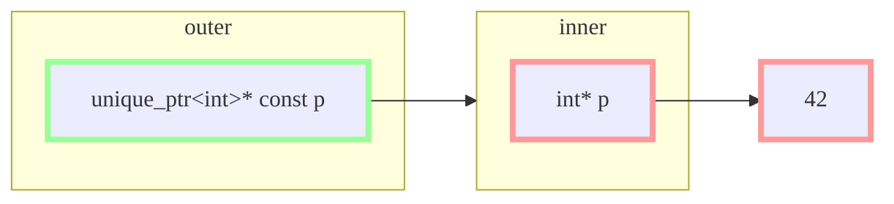
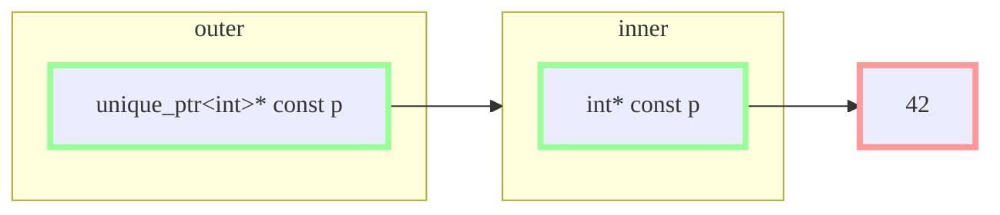
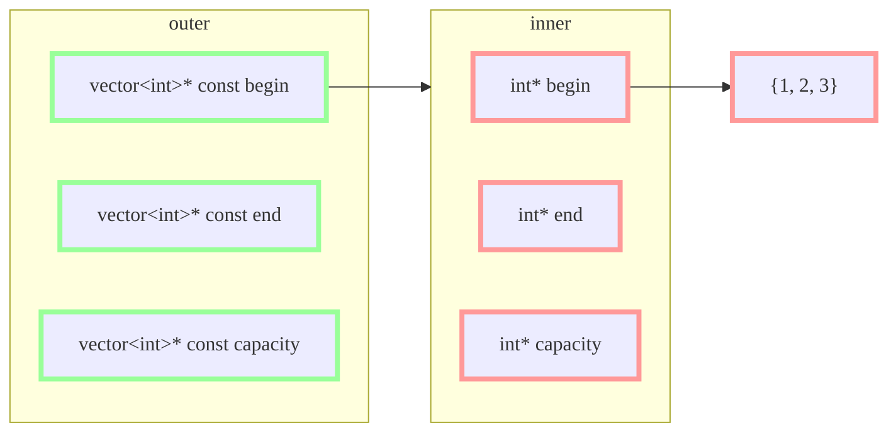

## Setting the Stage

Before C++20, we couldn't have any allocation during constant evaluation at all. Any attempt to do so would fail the evaluation — it would no longer be constant.

In C++20, as a result of [P0784R7](https://wg21.link/p0784), that changed. Finally we could do allocation during constant evaluation. However, this evaluation was extremely limited. Specifically, any allocation that happens must be deallocated during *that* constant evaluation.

This opened the door to a wide range of operations that weren't possible before. We can now have local `std::string`s and `std::vector<T>`s! Those just work!

But we still cannot just declare a `constexpr std::vector`:

```cpp
#include <vector>

constexpr std::vector<int> v = {1, 2, 3}; // error
```

And we cannot even declare a local `constexpr std::vector` in a `consteval` function:

```cpp
#include <vector>

consteval auto f() -> int {
    constexpr std::vector<int> v = {4, 5, 6}; // still error
    return v.size();
}
```

This limitation still remains in C++23 and could very well still remain in C++26. The goal of this blog post is to explain why we haven't just solved this problem already.

## The Two Problems

There are actually two problems here to solve, not just one, although we frequently talk about this as the `constexpr` allocation problem.

The problems are:

1. How do we know that we can allow an allocation to persist?
2. How do we know when we can use the contents of an allocation as a *constant-expression*?

Put differently, these are the constant destruction problem and the constant access problem. Let's go through each in turn.


## The Constant Destruction Problem

Let's start with the first problem, and use a simplified version of `std::unique_ptr<T>` to explain the issue:

```cpp
template <typename T>
class unique_ptr {
    T* ptr = nullptr;

public:
    constexpr unique_ptr() = default;
    constexpr unique_ptr(T* p) : ptr(p) { }
    constexpr unique_ptr(unique_ptr&& rhs) noexcept
        : ptr(rhs.ptr)
    {
        rhs.ptr = nullptr;
    }
    constexpr ~unique_ptr() { delete ptr; }

    constexpr auto operator=(unique_ptr&& rhs) noexcept
        -> unique_ptr&
    {
        reset(rhs.release());
        return *this;
    }

    constexpr auto get() const -> T* {
        return ptr;
    }

    constexpr auto operator*() const -> T& {
        return *ptr;
    }

    constexpr auto reset(T* p) -> void {
        T* old = ptr;
        ptr = p;
        delete old;
    }

    constexpr auto release() -> T* {
        T* old = ptr;
        ptr = nullptr;
        return old;
    }
};
```

Now, consider this extremely simple program:

```cpp
constexpr auto p = unique_ptr<int>(new int(42));

auto main() -> int { }
```

Today, this is ill-formed, because the allocation persists past the constant evaluation that is the initialization of the global variable `p`. But we want to change that. So what happens?

Well, eventually (at the end of the program) `p` is going to be destroyed, which means its destructor is going to be run. This happens at runtime. Now, whatever the compiler actually did to initialize `p`, it did _not_ allocate memory at runtime. The intent is that this behaves more like this:

```cpp
int __storage = 42;
constexpr auto p = unique_ptr<int>{.ptr = &__storage};

auto main() -> int { }
```

> We need `p` to be constant-initialized, and a runtime allocator is just not going to be able to cut it. Having static storage allows everything to be compiled into the binary.
{:.prompt-info}

And since we didn't _allocate_ this memory at runtime, we definitely cannot _deallocate_ the memory at runtime. Attempting to evaluate `p.ptr`, when that simply points to the static storage duration variable `__storage`, is going to crash (or worse). Even though this happens _after_ we return from `main`, that's still not acceptable. We can't just crash our way to progress.

What we really need to do is _not_ run `p`'s destructor at the end of the program. Or rather, check (during constant evaluation time) to make sure that `p`'s destructor cleans up any allocation. If it doesn't, fail the initialization. If it does, then go ahead and allow it to persist — but simply omit the call to `p`'s destructor at runtime.

Does that work?

Consider:

```cpp
constexpr auto ppi = unique_ptr<unique_ptr<int>>(
    new unique_ptr<int>(new int(42))
);

auto main() -> int {
    // NB: mutable
    unique_ptr<int>& pi = *ppi;

    // boom
    pi.reset(new int(43));
}
```

With just `unique_ptr<int>`, we can't really do much interesting. But add another layer of indirection, and we start to see some problems.

`unique_ptr<T>` is shallow-`const`, so even though `ppi` is a `constexpr` variable, dereferencing it gives us a _mutable_ `unique_ptr<int>`. Nothing in the type system prevents us from declaring `pi` there or invoking `reset`. But that `reset` call breaks in the same way that our original destructor broke: we're calling `delete` at runtime on a pointer that was allocated during compile time. That can't work.

Visually, our structure looks like (here, green indicates `const` and red indicates mutable):



The outer `unique_ptr`'s member (`ppi.p`) is effectively a `unique_ptr<int>* const` — it is a const pointer to mutable `unique_ptr<int>` — by virtue of it being a `constexpr` object. But the inner `unique_ptr` is mutable, which means its member pointer (i.e. `ppi.p->p`) is effectively just an `int*` — a mutable pointer to mutable `int`.

We checked to see that `ppi`'s destructor completely cleans up all the allocation (recursively into its subobjects), and it does so. But the problem is that this allocation is _mutable_ — in the example above we were able to swap out one allocation for another at runtime. If an allocation is mutable, then checking at compile time that it's cleaned up in the destructor is kind of meaningless. How do you know that the runtime destructor actually does the same thing that the compile-time destructor did, if you're allowed to change values at runtime?

Now, we _cannot_ make the call `reset` there ill-formed. If we get that far in the program, there is nothing in the type system that will stop us. So what do we do?

There are two easy ways out.

One easy way out is to simply prevent multi-layered allocation. If you only allow one layer of allocation, there's no problem. However, this seems awfully limiting and I really am only throwing this idea out for completeness. It is an *easy* way out, but not a good one.

The other easy way out is to simply call this undefined behavior. That's actually not as horrible as it might seem at first glance. There will definitely be some bar, somewhere, at which point we will have to introduce new undefined behavior. This is simply because `const_cast` exists. The only question is where that bar ends up being. Although admittedly it'd be nice to be able to reject as many questionable cases up front.

Even in this example, by simply adding `const` in a key place — having a `unique_ptr<unique_ptr<int> const>` instead of a `unique_ptr<unique_ptr<int>>` is sufficient. That would change our structure to be:



The inner-most pointer is still a pointer to _mutable_ `int`, but that doesn't affect the ability to perform constant destruction. We don't read the value `42` during destruction, so it doesn't matter. This structure would be safe to allow to persist to runtime.

The question then is: how can we reject the first construct (having a `constexpr unique_ptr<unique_ptr<int>>`) but allow the second (having a `constexpr unique_ptr<unique_ptr<int> const>`)? It's a tough question!

Before I answer that, consider real quick that `vector<T>` and `unique_ptr<T>` are not that different in terms of the actual members. Sure, `vector<T>` is deep-`const` while `unique_ptr<T>` is shallow-`const`, but as far as the language is concerned that is simply convention. A `vector<vector<int>>` has exactly the same problem as a `unique_ptr<unique_ptr<int>>`:



I already said I don't want to reject multi-layered allocation. And probably the most common use of a multi-layered allocation is going to be something like a `vector<vector<T>>` (or a `vector<string>` which is morally equivalent). So if whatever rule we come up with to reject the bad `unique_ptr<unique_<int>>` case also rejects the good `vector<vector<int>>` case, that's not a particularly useful rule.

> To the language, the two cases are the same. But the fact that `unique_ptr` is shallow-`const` and `vector` is deep-`const` do matter to the usability. The fact that the former directly exposes an inner `reset` but the latter does not means that you have to explicitly try to do the wrong thing with `vector`.
{:.prompt-info}

To summarize, the constant destruction problem is trying to figure under what conditions it is safe to persist a constexpr allocation to runtime. We need, at a minimum, that the destructor frees all memory. But we also would like some way to guard against, at the least, the easy and unintentional mutations of the allocation itself during runtime — by rejecting shallow-const nested allocations.

## The Constant Access Problem

It is arguably pointless to pursue allowing persistent `constexpr` allocation if the allocation itself cannot be used as a *constant-expression*. Meaning:

```cpp
// if we allow this
constexpr auto v = vector<int>{1, 2, 3};

// ... then we really should also allow this
static_assert(v[0] == 1);
static_assert(v[1] == 2);
static_assert(v[2] == 3);
static_assert(v.size() == 3);
```

The question is: how can we determine when we can use the contents of such an allocation as a constant?

Right away we can see with the `unique_ptr<int>` example that the answer clearly isn't: always. Jeff Snyder gave me this great example a few months ago:

```cpp
constexpr auto p = unique_ptr<int>(new int(42));

auto foo() -> void {
    array<int, *p> xs;                 // #1
    for (auto i = 0; i < *p; ++i) {    // #2
        xs[i] = i;
    }
}

auto main() -> int {
    *p = 47;                           // #3
    foo();
}
```

If `p` is an allowed declaration, then the mutation at `#3` is valid (`p` is a const pointer to a mutable `int`, so that `int` is allowed to be mutated). But then we have to ask what the value of `*p` is at lines `#1` and `#2`? This isn't much of a question though — at `#1` the value can only be `42` and at `#2` the value can only be `47`. So here we have code that on two consecutive lines is accessing the same seemingly-`const` expression and giving different answers? In a way that overruns the array, despite looking correct? Unacceptable.

This code must either:

1. be ill-formed at the point of the declaration of `p`, or
2. be ill-formed at the use of `*p` in `#1`

The first option means disallowing any constant allocation to persist if its value is reachable as mutable.

> This isn't quite the same rule as what I laid out in the previous section. For the constant destruction problem, we need the allocation (i.e. the pointer) to not be _read_ as mutable — and it is not in this example. Here, we additionally need the _contents_ of the allocation (i.e. the pointee) to not be _reachable_ as mutable, which is a stronger requirement.
{:.prompt-info}

The second option means disallowing the use of `*p` as a constant if it is reachable as mutable. Declaring and using `p` is fine — and the value of `p.p` is constant, it's simply that the value of `*p.p` is not constant.

Both cases require actually being able to tell if the contents are reachable as mutable — it's just a question what we do about the case where the rule is violated: disallow use as a constant, or completely disallow?

## Another Layer

Alright so far I've laid out the two problems we have to figure out how to address: constant destruction and constant access. But actually there's one more layer to this problem. Or at least, there _could_ be one more layer to this problem — if we so choose.

Up until now, we've been talking about having a constexpr allocation persist to runtime. It turns out, there aren't just two kinds of constant allocations — there are three.

1. A `constexpr` allocation is *transient* if it does not last past the constant evaluation that it was allocated in. This was the kind of allocation that was introduced in C++20, and is currently the only kind of allowed `constexpr` allocation.
2. A `constexpr` allocation is *non-transient* if it persists past the constant evaluation that it was allocated in, but not all the way to runtime.
3. A `constexpr` allocation is *persistent* if it was allocated during constant evaluation time but is usable at runtime.

The interesting thing about what I'm calling non-transient (but non-persistent) allocations is that we actually have more options available to us to address them, if we so choose. To make it clear what I'm talking about:

```cpp
// this would be a persistent allocation
constexpr auto a = unique_ptr<int>(new int(1));

constexpr auto f() -> int {
    // this is a transient allocation
    auto p = unique_ptr<int>(new int(2));
    return *p;
}

consteval auto g() -> int {
    // this is a non-transient allocation
    // the declaration of c begins a new constant evaluation,
    // but c isn't destroyed until the end of g().
    // Nevertheless, because g is consteval, the allocation
    // does not leak to runtime.
    constexpr auto c = unique_ptr<int>(new int(3));
    return *c;
}
```

The two variables `a` and `c` are both `constexpr` variables whose type is `unique_ptr<int>`. But `a` is usable at runtime (or, rather, potentially usable — depending on what rules we choose to adopt), whereas `c` is definitely not. The consequence of this is that all behavior that affects `c` can be controlled by the compiler.

We could simply say, by fiat, that all mutation of allocation that is owned by a `constexpr` variable during constant evaluation is _not allowed_.

That means that while `*a` can never be usable as a constant expression, `*c` could be — because we can enforce that `*c` is always the value `3`. The appeal here is that it opens the door to supporting non-transient `constexpr` allocation without yet supporting persistent `constexpr` allocation by solving a simpler problem. We can address the questions of constant destruction and constant access by disallowing all mutation during constant evaluation time, which means that everything... just works?

> Obviously, we cannot just disallow mutation during runtime. If we could, we probably would've just shipped that in C++20.
{:.prompt-info}

This was so appealing to me that I proposed that we do precisely that as part of [P3032R2](https://www.open-std.org/jtc1/sc22/wg21/docs/papers/2024/p3032r2.html). It's an easy enough rule to understand and it permits a lot of functionality that we want to permit. What's not to like?

Well...

It does have the unfortunate consequence of making the same code behave differently depending on context:

```cpp
constexpr auto a = unique_ptr<int>(new int(1));
static_assert(*a == 1); // must be ill-formed, *a isn't constant

constexpr auto f() -> void {
    constexpr auto b = unique_ptr<int>(new int(2));
    static_assert(*b == 2); // must be ill-formed, *b isn't constant
}

consteval auto g() -> void {
    constexpr auto c = unique_ptr<int>(new int(3));
    static_assert(*c == 3); // OK
}
```

That's a less than thrilling outcome, and kind of puts the brakes on the whole claim that it's an "easy enough rule to understand." It also doesn't help in establishing a path forward for persistent allocation, which would be even more valuable than simply allowing non-transient allocation.

It's always good to be able to make incremental progress, but it's not clear that the incrementalism actually helps here. It may very well be better to _not_ think of non-transient and persistent allocation as separate layers.

## Proposed Solutions

There are a few solutions on the table to getting persistent `constexpr` allocation to work (as separate from the P3032R2 suggestion to allow non-transient allocation specifically by rejecting mutation). I think they can be divided into two categories: attempt to come up with as coherent and safe a solution as possible within the confines of the C++ type system, or trust the programmer.

### `propconst`

Both `unique_ptr<int>` and `vector<int>` are types that have an `int*` member, but we recognize that these aren't the same kind of type. `unique_ptr<int>` runs into mutation problems both when dealing with destruction and constant access — because it is shallow `const`. `vector<int>` doesn't run into either problem because it is deep `const`. Is there a way that we can lift this notion of deep `const` into the type system? Doing so would allow us to differentiate between these types at the type system level — which would allow us to allow uses of `vector` that we would have to disallow for `unique_ptr`.

This was the intent of the `propconst` proposal: [P1974R0](https://wg21.link/p1974r0).

> As of this blog post in July 2024, r0 is the latest revision.
{:.prompt-info}

Jeff Snyder's proposal was to introduce a new *cv*-qualifier named `propconst` that would propagate `const` as a language feature. At its simplest:

```cpp
struct X {
    int propconst* p;
};

auto test(X& x) -> void {
    // a is an int&
    // x.p behaves like an int*
    auto&& a = *x.p;

    // b is an int const&
    // as_const(x).p behaves like an int const* const
    auto&& b = *std::as_const(x).p;
}
```

This feature would lead to changes in `std::vector<T>` to have members of type `T propconst*` instead of `T*`, but would _not_ lead to changes in `std::unique_ptr<T>`. It would let us adopt and enforce strict rules for destruction and constant access by way of readability and reachability as mutable. What's not to like?

One issue may be that having a `propconst` qualifier (in the same spot as `const` and `volatile`) may be a bit too much. On the plus side, it opens the door to a `const`-propagating tuple simply by doing `std::tuple<int propconst&>`. Oh the other hand, the word "simply" is doing a lot of work there — this requires other library (and possibly language) changes that are discussed in the proposal. That leads to an increase in complexity to handle things that aren't strictly related to the `constexpr` allocation problem.

To that end, Matt Calabrese had suggested a refinement of the proposal: rather than have it as a _qualifier_ (and thus appear in any context a type appears — and need to think about what that actually means in every case), what if `propconst` were a _specifier_ that could be used in the same context as `mutable` today? That wouldn't give us a const-propagating `std::tuple` and it appears to be a simpler proposal. I wrote this up on [P2670R1](https://wg21.link/p2670r1).

> A `propconst` specifier can appear in far fewer places than a `propconst` qualifier and doesn't lead to more language rules. But it's not as much simpler as one would hope — in particular it ends up being tricky to figure out what `propconst int** p;` [should actually mean](https://www.open-std.org/jtc1/sc22/wg21/docs/papers/2023/p2670r1.html#a-propconst-specifier).
{:.prompt-info}

Either approach to `propconst` does have the question of enforcement. We would require two kinds of checking:

1. for constant destruction: ensure when running the destructor that no allocation is read as mutable.
2. for constant access: ensure the allocation is not reachable as mutable in any path.

The first doesn't seem complicated — you evaluate the destructor and see what variables are read. The second is more obviously problematic. Consider:


```cpp
struct bad_vector {
    int propconst* begin;
    int          * end;      // oops, not propconst
    int          * capacity; // oops, not propconst
};
```

Given a `constexpr bad_vector v`, you cannot mutate through `begin` — but you can mutate through `end`. Which means that constant access would have to be prohibited. Basically, every pointer into an allocation (anywhere into an allocation) must propagate const.

One way to think about the `propconst` approach is that it's a proof system. We make the constant evaluation engine _prove_ that we correctly implemented a deep `const` type. Expanding on the example:

```cpp
struct bad_vector {
    int propconst* begin_;
    int* end_;
    int* capacity_;

    // these do the right/expected thing
    constexpr bad_vector(std::initializer_list<int> xs);
    constexpr ~bad_vector();
    constexpr auto operator[](size_t)       -> int&;
    constexpr auto operator[](size_t) const -> int const&;

    // these... almost do
    constexpr auto begin()       -> int*       { return begin_; }
    constexpr auto begin() const -> int const* { return begin_; }
    constexpr auto end()         -> int* { return end_; }
    constexpr auto end()   const -> int* { return end_; }
}
```

Here, we accidentally forgot to make `end_` and `capacity_` propconst, and then `end() const` accidentally returns an `int*` instead of an `int const*`. This will compile just fine. It'll probably pass most tests that you write, since `int*` is usable as a constant iterator just fine as long as you don't try to mutate through it. All the comparisons work, etc.

Except that, of course, you still end up with a mutable iterator that otherwise satisfies all the language rules.

With `propconst` though, just one test is sufficient:

```cpp
constexpr auto v = bad_vector{1, 2, 3};

// error: cannot use v[0] as a constant expression
// because the allocation is reachable as mutable
// through v.end_ and v.capacity_
static_assert(v[0] == 1);
```

The missing `propconst` can fool most tests, but it won't fool the constant evaluator.

### Trust, Don't Verify

Alternatively, we can ask the question: how much does such verification buy us in practice? The verification that a `propconst` needs to do in order to achieve sound-ness is quite thorough: for every pointer and reference member (recursively), we need to ensure that for destruction there is no mutable path to an allocation.

It turns out it isn't enough to simply verify that the variables read during the destructor aren't mutable — we would really have to track every member. Consider:

```cpp
struct C {
    propconst int* alloc; // regardless of which design
    int** internal;

    constexpr C() {
        alloc = new int(42);
        internal = &alloc;
    }

    constexpr ~C() {
        delete alloc;
    }
};

constexpr C c;
static_assert(*c.alloc == 42);

auto main() -> int {
    delete *c.internal;
    *c.internal = new int(43);
}
```

Here, we have an internal pointer of type `int**` that points to our local member `alloc`. In our destructor, we do not read any variable that is reachable as mutable — `alloc` is declared `propconst`, which was supposed to solve this problem for us. However, `internal` is a mutable pointer into that allocation and we can interact with it without any trouble from the type system.

Basically, while either of the `propconst` designs give us some guarantees of sound-ness — those guarantees are expensive to provide. And even then, there are some operations that we would have to declare as being undefined behavior anyway. For instance:

```cpp
auto main() -> int {
    auto p = unique_ptr<int const>(new int(5));
    *const_cast<int*>(p.get()) = 6;
    static_assert(*p == 5);
}
```

That mutation actually isn't undefined behavior today — the `int` object wasn't created as `const`, so it's simply allowed to be mutated. But I'm not super worried about this case, because it requires an explicit `const_cast`.

That said — there is an alternative design to `propconst` that doesn't require expensive tracking of all members of a type: we provide a magic library function that the library author can use to mark their allocation as immutable and just trust that they use it correctly. In the original design, this function was called `std::mark_immutable_if_constexpr()`.

> This function appeared in [P0784R5](https://wg21.link/p0784r5), but that revision is extremely light on details about how this function is intended to be used or even what it does. That revision also did not touch on the constant access problem at all, it solely dealt with the constant destruction problem.
{:.prompt-info}

This design is quite simple: an allocation is allowed to persist if it has been marked immutable. The contents of an allocation are usable as a constant expression if has been marked immutable. Effectively, we combine the constant destruction and access problems into a single problem and treat them uniformly. It would be up to the library author to know when and how to use this function.

For instance:

```diff
template <typename T>
class unique_ptr {
    T* ptr = nullptr;

public:
    constexpr unique_ptr(T* p)
        : ptr(p)
    {
+       if constexpr (std::is_const_v<T>) {
+           std::mark_immutable_if_constexpr(ptr);
+       }
    }
};

template <typename T>
class vector {
    T* begin_;
    T* end_;
    T* capacity_;

public:
    constexpr vector(std::initializer_list<T> elems) {
        begin_ = std::allocator<T>{}.allocate(elems.size());
        end_ = capacity_ = std::uninitialized_copy(
            elems.begin(), elems.end(), begin_);
+       std::mark_immutable_if_constexpr(begin_);
    }
};
```

Basically, `unique_ptr<T>` is only immutable if `T` is `const`, but `vector<T>` is always immutable. And these would be marked at the end of initialization. Constant evaluation would reject any mutation into an allocation marked immutable.

The result is that while the `propconst` design would have allowed for a `constexpr unique_ptr<int>`, the mark immutable design does not. Is that a big loss in functionality? Unlikely. I have, on many, many, many occasions, had a need for persistent constexpr allocation that used a `vector` or a `string` or a `map`. I cannot recall an instance in which I really needed a persistent constexpr mutable `unique_ptr`. I cannot say with certainly that such a thing is completely useless (it almost certainly has some use), but the overwhelming value of persistent constant allocation would come from constant access — so it's not unreasonable to group these problems together.

Of course, the section title here isn't "Trust, But Verify" — it's "Trust, Don't Verify." There is nothing to stop the user from writing a shallow const type (like `unique_ptr<T>`) and marking its allocation immutable unconditionally. The type system will allow it just fine, and this could lead to either nonsensical behavior (mutating a "constant" at runtime) or crashes or worse (deallocating a constexpr allocation that wasn't actually a runtime allocation). It would be up to the library author to only mark an allocation immutable if they are sure there is no mutable access into it.

But I'm not actually sure that's such an egregious problem. These containers already exist and are deep const.

There is a more conservative option here too. Rather than providing a magic library function to users to mark their allocations immutable, we could just say, by fiat, that standard-library-provided specializations of `std::basic_string` and `std::vector` _just work_. We're not going to say _how_ they work, just that such allocations are allowed to persist and are usable in constant expressions. Just full stop, without specifying any details of how such a thing might work. It's the Standard Library. They're allowed to do whatever they want.

There is clearly some appeal to this approach. `std::basic_string` and `std::vector` are probably a significant percentage of the total benefit of this approach. And we don't have to worry about potential harms — these two containers are already, definitely, correctly written and `const`-propagating. But it's also obviously unsatisfying — those are hardly the only two containers that exist in the universe of C++ code!

### Quick Comparison

Both approaches presented here would require code changes in the various containers to support persistent allocation that is usable as a *constant-expression*: whether by somehow marking the allocation in the constructor or by somehow marking the members.

A `propconst`-based approach promises more sound-ness by catching more potential errors at compile-time, at the cost of having to do all the checking necessary to catch those errors and a more complicated model. A `propconst`-based approach would also allow for a `constexpr unique_ptr<int>` — such that the allocation is constant but the contents thereof are mutable.

A trust-based approach is a far simpler model. It supports fewer possibilities by using a single tool to solve both the constant access and destruction problems — as a result it would not support `constexpr unique_ptr<int>`. It could lead to unsafe allocations if library authors do not use the tool carefully. However, it does mean that almost nothing needs to be done at compile-time to verify that persistent allocation and constexpr access is possible.


## Where do we go from here?

At the moment, we're at something of an impasse. We discussed this problem a bit at the St. Louis meeting and took a few directional polls.

One for whether we wanted to allow non-transient but not persistent allocation (as discussed [here](#another-layer), which would allow the different behavior of `unique_ptr`):

|SF|F|N|A|SA|
|-|-|-|-|-|
|2|14|1|2|2|

And one for whether we wanted to just by fiat support persisting allocations from `std::basic_string` and `std::vector` and not worry about any other allocation:

|SF|F|N|A|SA|
|-|-|-|-|-|
|4|9|8|3|0|

It's not an easy problem, and it lacks a silver bullet — at least one that I'm aware of. Personally, I've changed my mind many times about this problem over the years. At this point I think my favorite design is actually the `std::mark_immutable_if_constexpr()` one. It doesn't give us protection, but it's also the simplest to understand and reason about, and also doesn't require extensive tracking by the implementation to provide the guarantees that we would require of `propconst`.

> Calling it my favorite might be the wrong term. More like my least disliked?
{:.prompt-info}

I am not super concerned about not having the protection `propconst` gives us for a few reasons. First, most uses of `constexpr` allocation are going to come from existing container types suitably annotated. Those should already properly propagate `const`, and if they don't, that's a separate problem. Second, if there is any doubt about someone's ability to write a `const`-propagating type and if they wish they could lean on `propconst` to ensure correctness here, there is always a library solution for that. The Library Fundamentals TS had a [type](https://en.cppreference.com/w/cpp/experimental/propagate_const) called `std::propagate_const<T>` (for pointer-like types `T`, like `int*` or `std::unique_ptr<int>`) that would simply behave like a `const`-propagating pointer. `std::propagate_const<int*>` behaves like `propconst int*`, except that you can implement it today without any language changes. When in doubt, this could give you the type system protections that `propconst` would give you (although not the full-blown all-paths analysis). If that's desired, we have the tools to build it.

Regardless, I do think it's important to at least provide support for persistent `std::string` and `std::vector` in the C++26 time-frame though, especially with Reflection on the way. Given that there's clear support for solving the problem _somehow_, I'm hoping that we can all coalesce on _some_ solution — whatever it may be.