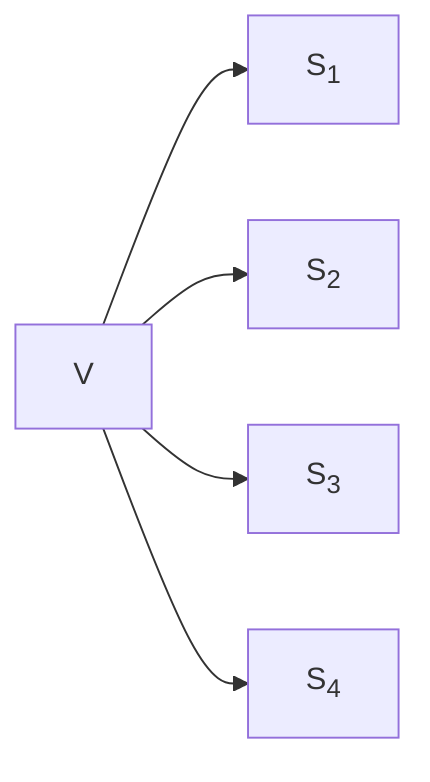
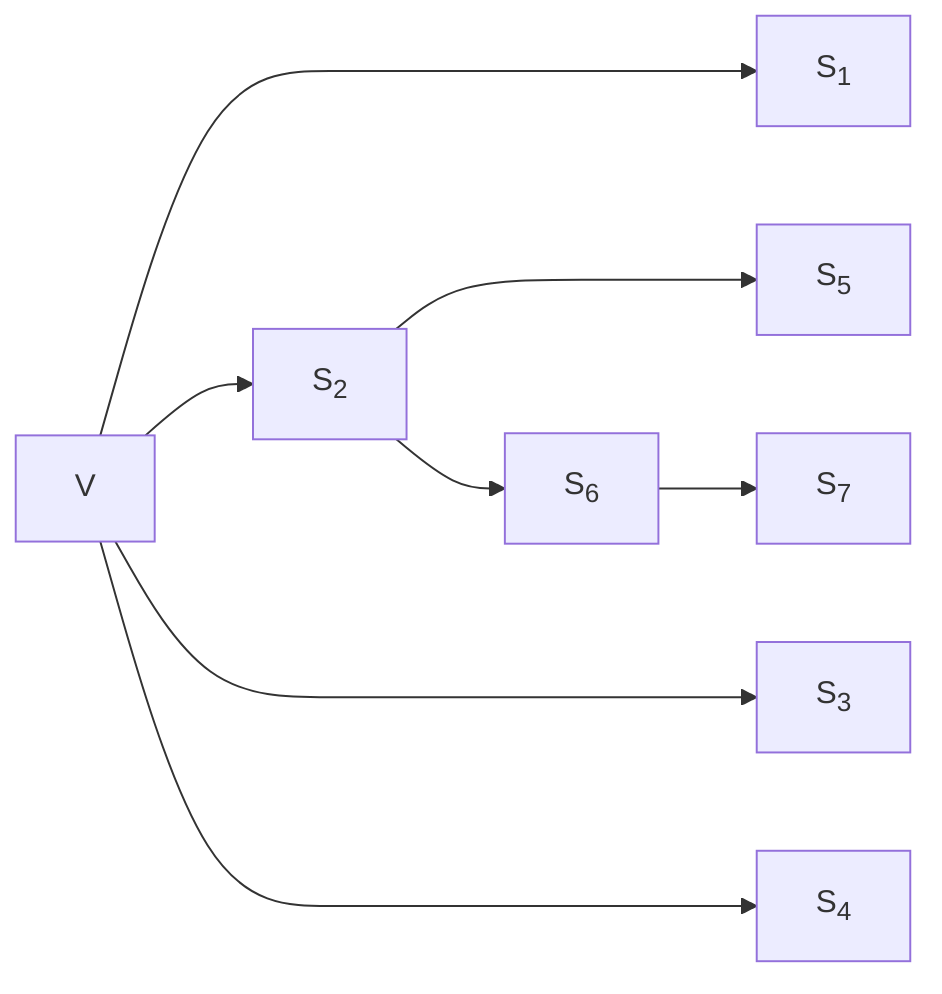
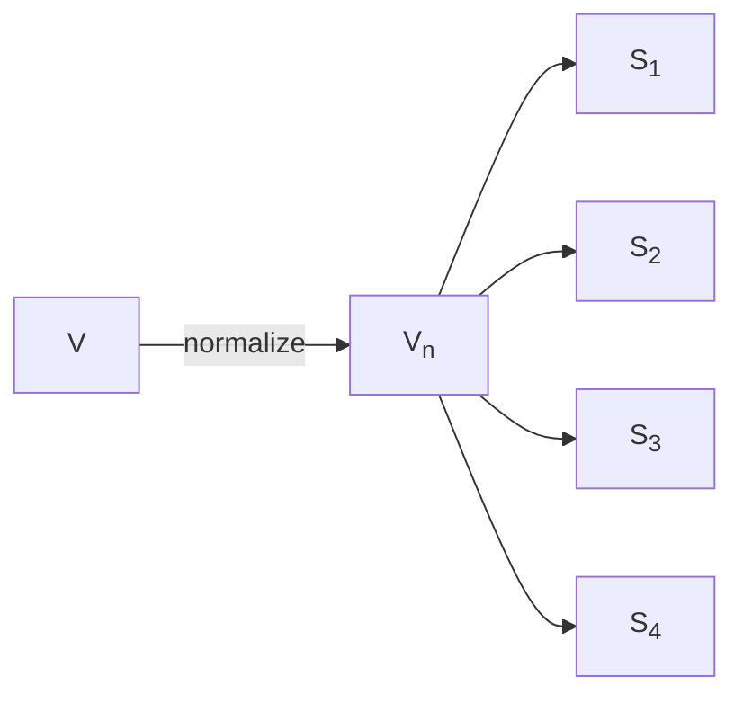
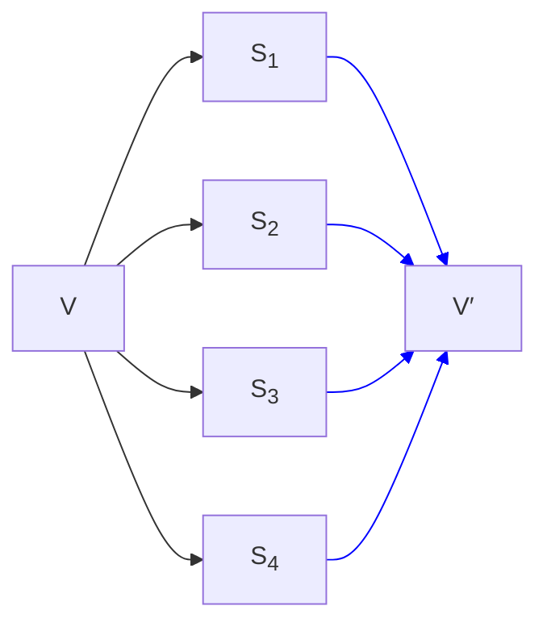
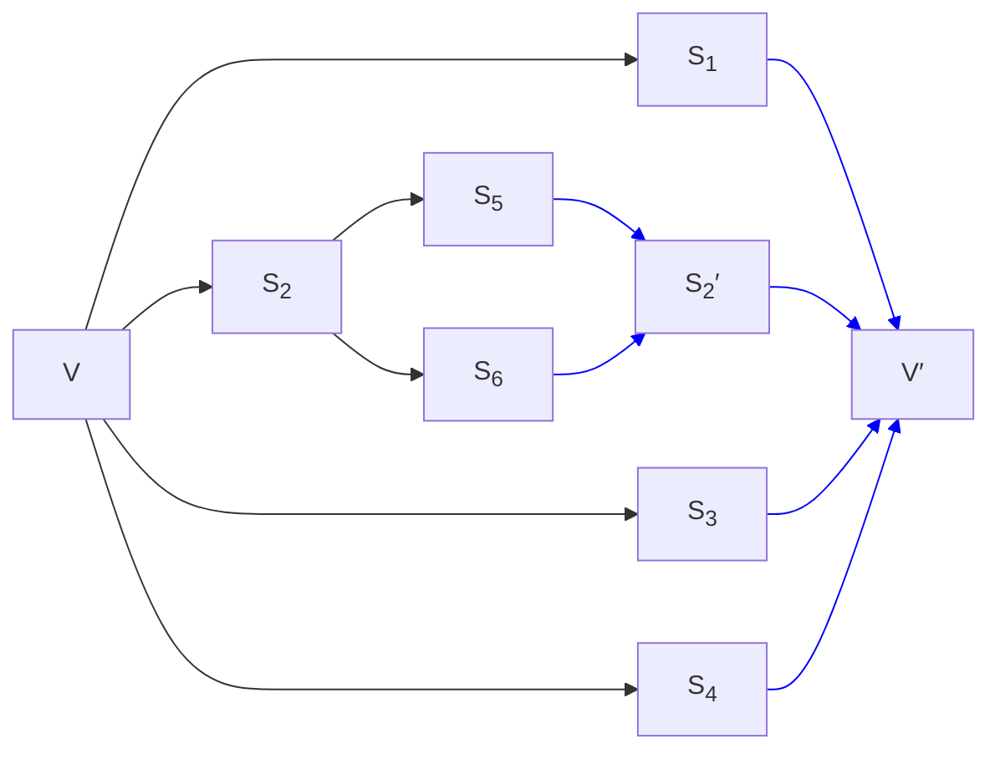

## Setting the Stage

Previously, I tried to answer the question: [what's so hard about `constexpr` allocation?](). Today, we continue what will become a series of posts about attempting to explain the issues behind a bunch of hard problems we're trying to solve. The next problem: class types as non-type template parameters.

Before C++20, the only types you could use as non-type template parameters were scalar types (like `int` and `enum`s, but not floating point), pointers (including pointers-to-members), and references. Notably, not class types.

> Floating point types were also added in C++20.
{:.prompt-info}

The hard question about handling class types is: how do you determine _template argument equivalence_? Class types can define their own equality. But you don't really want to rely on that, since now matching specializations becomes a quadratic problem — you can't really do much when determining the instantiation for some template `f<v1>` other than looping through every other value `vi` to see if `v1 == vi`.

The other problem is we need `==` to really be _strong_ enough. One very easy problem to run into in this space is violating the One Definition Rule (ODR). One essential, core requirement for templates is that instantiating the _same_ template with the _same_ arguments has to yield the _same_ code. Consider what goes wrong if we have a bad equality operator and we relied upon that equality operator for matching specializations:

```cpp
struct Pair {
    int x;
    int y;

    constexpr auto operator==(Pair const& rhs) -> bool {
        // oops, we only compare x
        return x == rhs.x;
    }
};

template <Pair P>
constexpr auto get_y() -> int {
    return P.y;
}

constexpr int a = get_y<Pair{.x=1, .y=2}>();
constexpr int b = get_y<Pair{.x=1, .y=3}>();
static_assert(a == b); // yes!
```

We have two objects of type `Pair` that we're creating. Those compare equal using `Pair::operator==` because we're only comparing `Pair::x`. So the two calls to `get_y` would have picked the same specialization! But... which specialization? Is `a == 2` or is `a == 3`? Who knows!

Having a design that combines terrible performance with easy-to-hit ODR violations is untenable. Which is why nobody ever proposed such a thing.

However, in the C++20 timeframe, we adopted `<=>`.

> I may have written a [post or two](/tags/spaceship) about `<=>` at some point...
{:.prompt-info}

The interesting thing about `<=>` for the purposes of this discussion is that you can _default_ `<=>`. And, importantly, the compiler can verify that your class is comprised (recursively) only of scalar types or class types with defaulted `<=>`. This was Jeff Snyder's insight when he wrote [P0732](https://www.open-std.org/jtc1/sc22/wg21/docs/papers/2018/p0732r2.pdf): we can rely on the class _structurally_ having member-wise equivalence. This lets us ensure both that we don't need to rely on quadratic comparison (since we can explode a class type into a corresponding tuple, and then hash that) and there is no ODR issue (because the comparison is definitely correct by construction). Everyone was pretty excited about this.

However, a few problems surfaced with this approach of trying to define template argument equivalence based on defaulted `<=>` (and later based on defaulted `==`). These were two kinds of inconsistencies pointed out in [P1907R0](https://www.open-std.org/jtc1/sc22/wg21/docs/papers/2019/p1907r0.html):

* (A) The run-time result of `x == y` differs from the compile-time result of `std::is_same_v<A<x>, A<y>>` for a suitably chosen template `A`.
* (B) The behavior of `x` as a top-level template argument differs from its behavior as a member of a class, a value of which is used as such a template argument.

Some examples of the first kind of inconsistency are:

* Pointer-to-member types

  ```cpp
  union U {
    int x;
    int y;
  };
  template<int U::* p> struct A;
  ```

  `A<&U::x>` and `A<&U::y>` are different types (and have been for a while), but `&U::x == &U::y` is `true`.

* Floating point types

  `A<-0.0>` and `A<+0.0>` are different types because they have different value representations, but `-0.0 == +0.0` is `true`.

And the big example of the second kind of inconsistency is reference members. We've always been able to have non-type template parameters of reference type — two references are template argument equivalent if they refer to the same object (or function). But having a reference member in a class does not let you have a defaulted `operator==`, so such a class type would not be usable as a non-type template parameter.

Additionally, while having defaulted comparisons would work fine for some class types, it would not work for many important ones:

* `std::optional<T>` could theoretically have a defaulted `operator==` if the `bool` were declared first, but the language rules (unsurprisingly) forbid defaulting a comparison with a `union` member.
* `std::variant<Ts...>` definitely could not work once you get to more than one alternative.
* For container types like `std::string` and `std::vector<T>`, member-wise comparison would compile — but is clearly wrong.

Basically the design based on defaulting comparison has a few issues in of itself and does not really allow for a path forward to support more kinds of class types. But we _really_ wanted to have class types as non-type template parameters. It is an incredibly useful feature.

So at the end of the C++20 cycle, a new design was formulated based on the essence of Jeff's original idea: we still ensure that we compare class objects _structurally_ — it's just that we don't rely on a defaulted comparison operator to do so. We just directly look at all the members (recursively) and say that two objects of the same class type are template-argument-equivalent if all of their corresponding members are. This gives us the right rule for pointers to members, floating point types, and references. And this could even work for `std::optional<T>` and `std::variant<Ts...>`!

> If this seems surprising, keep in mind that template-argument-equivalence is a compile-time property, not a runtime one. And at compile-time, the compiler knows which alternative is active in every `union`. Hence, it can compare them.
{:.prompt-info}

However it still definitely cannot work for `std::string` or `std::vector<T>`. We do not want equivalence of `std::string`s to be based on the address of the contents, we want it to be based on the contents themselves. In an effort to get as much value as possible, a compromise design was decided where we just do the member-wise equivalence algorithm if every member is public — on the premise that if all your members are public, there can't really be much of an invariant between them and so treating your type as a bag of independent entities seems reasonable.

And that's where we ended up in C++20, with [P1907R1](https://www.open-std.org/jtc1/sc22/wg21/docs/papers/2019/p1907r1.html), and those are the rules we still have in C++23 and will likely still have in C++26. It's not a complete feature — we got `std::pair` but not `std::tuple`, `std::optional`, `std::variant`, `std::string`, or `std::vector` — but it's tremendously more useful than having no feature. I'd call that a win.

But the question is: okay, how can we get the rest of the types too? The stage has been set. Now let's introduce our players.

## A Serialization Problem

All the work at this point has established pretty clearly that template argument equivalence is a serialization problem. What the defaulted-`<=>` design established, and then the defaulted-`==` design and the structural type design preserved, was that we need to treat a class type as being comprised of a bunch of scalar types and having equivalence be based on those scalars.

However we generalize the non-type template parameter problem to more interesting class types is going to require a mechanism for the user to tell the compiler how their class decomposes. Put differently: how can the compiler serialize your class.

More formally, serialization takes a value `v` and explodes it into some tuple of structural types:



Since the resulting types have to themselves be structural, that means they themselves can be (recursively) serialized. Regardless of what mechanism we could use to specify serialization, the compiler can do the recursive part itself without any user input. So in real life it might look more like this (where the values in the right-most column are those scalar/pointer/reference types that cannot further decompose):



For types like `std::tuple`, `std::optional`, and `std::variant`, that is still going to be member-wise serialization, it just needs to be done explicitly. For types like `std::string` and `std::vector`, we need to serialize the length of the container followed by every element in the container. We would need to come up with what the right syntax could be — but I don't want to get bogged down by syntax here. Unfortunately, syntax is far from the only problem we have to worry about here...

## A Normalization Problem

One of the examples that got brought up frequently during discussion is:

```cpp
struct Fraction {
    int num;
    int denom;
};
```

Should `Fraction{1, 2}` be able to be template-argument-equivalent to `Fraction{2, 4}`? That is, should the serialization process be allowed to also do normalization? Maybe you want to minimize your template instantiations?

I find this particular example difficult to reason about whether it matters, but there is another that I think is more compelling (courtesy of Richard Smith). Consider:

```cpp
class SmallString {
    char data[32];
    int length; // always <= 31

public:
    // the usual string API here, including
    constexpr auto data() const -> char const* {
        return data;
    }
};
```

Now, the contents of `data` beyond `length` should not affect template argument equivalence of `SmallString`. An empty string with `data[3] == 'x'` should be the same template argument as an empty string where `data[3] == 'y'`. That's probably what most people would expect to happen. And you'd certainly implement `pop_back()`, for instance, as simply decrementing `length` to avoid wasting time modifying `data` unnecessarily.

But consider this:

```cpp
template <SmallString S>
auto bad() -> void {
  if constexpr (S.data()[3] == 'x') {
    // thing 1
  } else {
    // thing 2
  }
}
```

And now we're back to the ODR bomb that I talked about earlier. It becomes impossible to know what what such a template might do — which version of `S` is used? What does `S.data()[3]` happen to be? It's not a great place to end up.

It's not enough to just say that `SmallString` serializes as `data[0:length]` (regardless of what mechanism we come up with for doing such a thing). This is a case where we really want to ensure that we have control of the entire representation. Which we could do by allowing some kind of normalization step as part of the serialization process. That is: first we would normalize the representation (in this case, by setting `data[length:32]` to `0`) and then we would serialize. This would ensure that `bad<S1>` and `bad<S2>` would do the same thing regardless of the trailing contents of `data`, avoiding the ODR problem. However, it requires the class author to recognize this trap and avoid it.

We might visualize this normalization step as:



Alternatively...

## A Deserialization Problem

Let's say the class author of `SmallString` serializes the representation they want for template-argument-equivalence consideration. Now, instead of using the serialized representation for equivalence and the original object for code, we could do something else. We could run a _deserialization_ step to produce the actual template argument.

We would start with a `SmallString` of some length, such that we care about `data[0:length]` but we do not care about `data[length:32]`. Serialization gives us just the `data[0:length]` part. And then, using just that part, we produce a _new_ object of type `SmallString` that is constructed from that value. It doesn't actually matter what the contents of `data[length:32]` end up being in this case — it doesn't matter if they are all `\0` (likely from a sane implementation) or all `0xAA` (because who doesn't like an infinite scream).

This does requires more work on the class author — they have to write both serialization and deserialization logic. However, it provides a fairly significant benefit: there is _no possible ODR violation_. Whatever the resulting value that we get out of deserialization, that is _reliably_ the value of the template argument for all values of the original type that compare template-argument-equivalent to each other. We don't have to worry about which of a bunch of possible specializations is chosen by the compiler/linker.

Deserialization actually implicitly does normalization — the roundtrip of a value through (de)serialization is normalized. But while ODR problems can be avoided by careful use of normalization, ODR problems are avoided entirely by construction if we require deserialization. That's pretty appealing. And the process can have some added checks too! The compiler can perform one extra serialization step to ensure that:

```cpp
serialize(deserialize(serialize(v))) === serialize(v)
```

This check ensures that the round-trip is sound by construction.

In the same way that serialization converts a value into a tuple of structural types, deserialization starts with that tuple of structural types and produces a possibly-new value of the original type:



But in the same way that serialization works recursively in a way that the compiler can take care of for you, deserialization could do. And it's important that it work like this for the same reason. So a more complex diagram might be:



Note that the serialization logic produces <code>S<sub>2</sub></code> but the deserialization logic only sees <code>S<sub>2</sub>′</code>, without the class author having to worry about how to produce it.


## What are the Options?

Still not considering any kind of syntax for how we might approach these problems, there are a few potential solutions to generalized support for class types as non-type template parameters. Also from Richard:

1. Serialization only (no normalization or deserialization). This can result in misbehavior as in the `bad<s1>` vs `bad<s2>` case, since these are different functions even when `s1` and `s2` represent the same value but with different representations thereof (e.g. different trailing data).
2. Serialization with manual normalization, with the serialization function also getting to modify the value to put it into a normalized state. This can work if the normalization is done correctly (so that the result of normalization only depends on state that was serialized), but there is no enforcement of this, and if you get it wrong that's ill-formed, no diagnostic required. Same as above.
3. Serialization and deserialization. This just works, by construction, in the same way that the C++20 design just works, by construction. There's no new source of ill-formed, no diagnostic required. We implicitly get normalization by serialization-deserialization round-tripping, and can even validate at compile time that the implementation of serialization and deserialization is coherent.

Those are, I think the main options. And of these, I think it's clear that (3) is the superior choice. The question is simply how we can express that to users such that it's not a huge implementation burden. Because we want to handle the simple cases as simply as possible. Which, in this case, are:

* Classes where member-wise serialization is sufficient (like `std::tuple`, `std::optional`, and `std::variant`). In these cases it would be nice to be able to easily express that the goal is to just serialize the class state without normalization or deserialization.
* Classes where a simple normalization step gets you to where member-wise serialization is sufficient (like `SmallString` — if we do something consistent with the trailing parts of the array, then member-wise equivalence is correct).

The question then, is: how do you design an API for generalized serialization and deserialization for template argument equivalence? And what do you do to make the simple cases simple?

## The Paper

In late 2021, Richard Smith and I wrote a paper to extend support for class types as non-type template parameters: [P2484R0](https://www.open-std.org/jtc1/sc22/wg21/docs/papers/2021/p2484r0.html).

The design was based on doing custom serialization and deserialization. Given a class type `C`:

* serialization was done by way of an `operator template()` which had to return type `R`, which had to be structural.
* deserialization was done by way of a constructor from `R`.

This approach does satisfy the overall goal of avoiding ODR issues (although the paper does not mention this at all), but the design had some issues.

For one, it doesn't cleanly support the case where we just want member-wise template argument equivalence but our members happen to be `private` (the `tuple`/`optional`/`variant` cases). The paper tried to address this by allowing you to declare `operator template()` as _defaulted_, which doesn't really seem semantically equivalent to the non-defaulted case. But we could potentially make the argument that rather than `operator template()` returning some distinct type `R`, that it could instead return an object of type `C` — and by doing so this explicitly opts `C` into being member-wise structural.

That is, the serialization implementation for `std::optional<T>` could be something like this:

```cpp
template <class T>
class optional {
    // these are private
    union { T value_; };
    bool engaged_;

    consteval operator template() const -> optional {
        return *this;
    }

    // ... rest of API ...
}
```

It's a lot of typing for a default, but it does get the job done, and it at least is semantically consistent.

Another problem it doesn't clearly support variable-length data. How do we serialize `std::vector<int>`? `std::string`? The `SmallString` class from earlier? The paper kind of punted on this question, suggesting that maybe we just make `std::vector<T>` a structural type by fiat since the language can just know what it means. THat's not actually all that unreasoanble?

The implementation for the `SmallString` class from earlier would then look like:

```cpp
class SmallString {
    char data[32];
    int length; // always <= 31

    struct Repr { std::vector<char> v; };

    // serialize
    consteval operator template() const -> Repr {
        return Repr{.v=std::vector<char>(data, data+length)};
    }

    // deserialize
    consteval explicit SmallString(Repr r)
        : data() // ensure zeros
        , length(r.v.size())
    {
        std::ranges::copy(r.v, data);
    }

public:
    // the usual string API
};
```

It's at least not a bad start.

