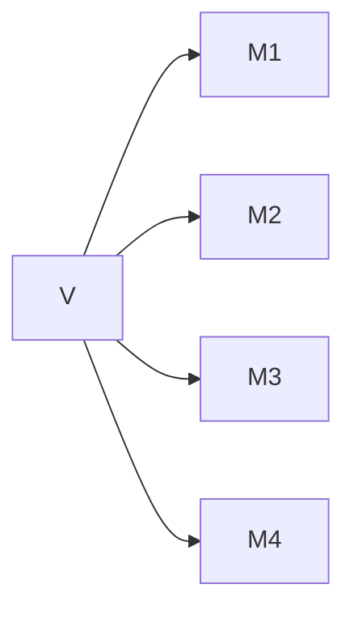
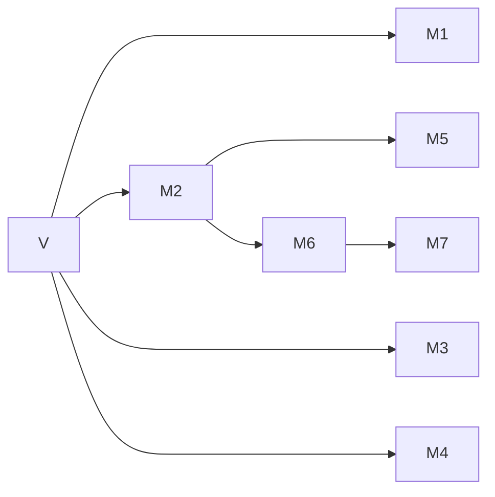
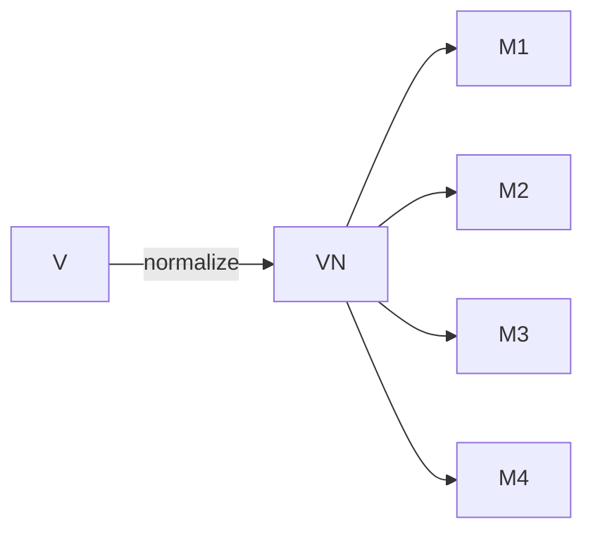
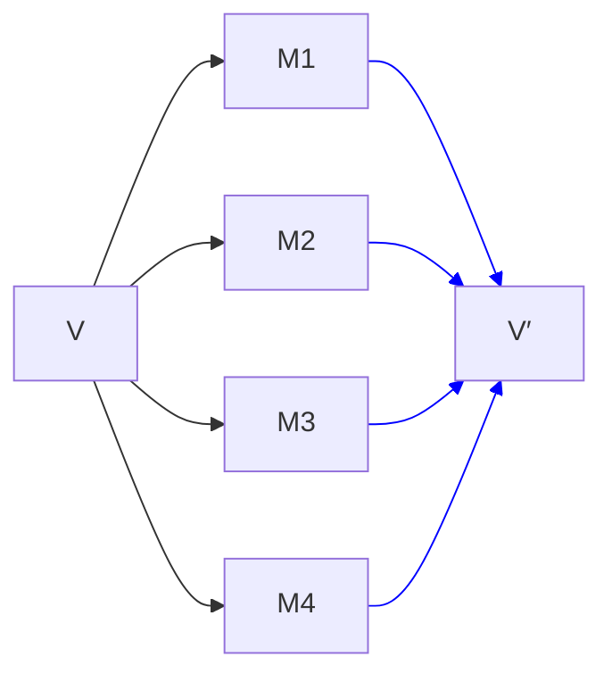

## Setting the Stage

Previously, I tried to answer the question: [what's so hard about `constexpr` allocation?](). Today, we continue what will become a series of posts about attempting to explain the issues behind a bunch of hard problems we're trying to solve. The next problem: class types as non-type template parameters.

Before C++20, the only types you could use as non-type template parameters were scalar types (like `int` and `enum`s, but not floating point), pointers (including pointers-to-members), and references. Notably, not class types.

> Floating point types were also added in C++20.
{:.prompt-info}

The hard question about handling class types is: how do you determine _template argument equivalence_? Class types can define their own equality. But you don't really want to rely on that, since now matching specializations becomes a quadratic problem — you can't really do much when determining the instantiation for some template `f<x>` other than looping through every other value `vi` to see if `x == vi`.

The other problem is we need `==` to really be _strong_ enough. One very easy problem to run into in this space is violating the One Definition Rule (ODR). One essential, core requirement for templates is that instantiating the _same_ template with the _same_ arguments has to yield the _same_ code. Consider what goes wrong if we have a bad equality operator and we relied upon that equality operator for matching specializations:

```cpp
struct Pair {
    int x;
    int y;

    constexpr auto operator==(Pair const& rhs) -> bool {
        // oops, we only compare x
        return x == rhs.x;
    }
};

template <Pair P>
constexpr auto get_y() -> int {
    return P.y;
}

constexpr int a = get_y<Pair{.x=1, .y=2}>();
constexpr int b = get_y<Pair{.x=1, .y=3}>();
static_assert(a == b); // yes!
```

We have two objects of type `Pair` that we're creating. Those compare equal using `Pair::operator==` because we're only comparing `Pair::x`. So the two calls to `get_y` would have picked the same specialization! But... which specialization did we pick? Is `a == 2` or is `a == 3`? Who knows!

> Even worse, the answer could be both!
{:.prompt-info}

Having a design that combines terrible performance with easy-to-hit ODR violations is untenable. Which is why nobody ever proposed such a thing.

However, in the C++20 timeframe, we adopted `<=>`.

> I may have written a [post or two](/tags/spaceship) about `<=>` at some point...
{:.prompt-info}

The interesting thing about `<=>` for the purposes of this discussion is that you can _default_ `<=>`. And, importantly, the compiler can verify that your class is comprised (recursively) only of scalar types or class types with defaulted `<=>`. This was Jeff Snyder's insight when he wrote [P0732](https://www.open-std.org/jtc1/sc22/wg21/docs/papers/2018/p0732r2.pdf): we can rely on the class _structurally_ having member-wise equivalence. This lets us ensure both that we don't need to rely on quadratic comparison (since we can explode a class type into a corresponding tuple, and then hash that) and there is no ODR issue (because the comparison is definitely correct by construction). Everyone was pretty excited about this.

However, a few problems surfaced with this approach of trying to define template argument equivalence based on defaulted `<=>` (and later based on defaulted `==`). These were two kinds of inconsistencies pointed out in [P1907R0](https://www.open-std.org/jtc1/sc22/wg21/docs/papers/2019/p1907r0.html):

1. The run-time result of `x == y` differs from the compile-time result of `std::is_same_v<A<x>, A<y>>` for a suitably chosen template `A`.
2. The behavior of `x` as a top-level template argument differs from its behavior as a member of a class, a value of which is used as such a template argument.

Some examples of the first kind of inconsistency are:

* Pointer-to-member types

  ```cpp
  union U {
    int x;
    int y;
  };
  template<int U::* p> struct A;
  ```

  `A<&U::x>` and `A<&U::y>` are different types (and have been for a while), but `&U::x == &U::y` is `true`.

* Floating point types

  `A<-0.0>` and `A<+0.0>` are different types because they have different value representations, but `-0.0 == +0.0` is `true`.

And the big example of the second kind of inconsistency is reference members. We've always been able to have non-type template parameters of reference type — two references are template argument equivalent if they refer to the same object (or function). But having a reference member in a class does not let you have a defaulted `operator==`, so such a class type would not be usable as a non-type template parameter.

Additionally, while having defaulted comparisons would work fine for some class types, it would not work for many important ones:

* `std::optional<T>` could theoretically have a defaulted `operator==` if the `bool` were declared first, but the language rules (unsurprisingly) forbid defaulting a comparison with a `union` member.
* `std::variant<Ts...>` definitely could not work once you get to more than one alternative.
* For container types like `std::string` and `std::vector<T>`, member-wise comparison would compile — but is clearly wrong.

Basically the design based on defaulting comparison has a few issues in of itself and does not really allow for a path forward to support more kinds of class types. But we _really_ wanted to have class types as non-type template parameters. It is an incredibly useful feature.

So at the end of the C++20 cycle, a new design was formulated based on the essence of Jeff's original idea: we still ensure that we compare class objects _structurally_ — it's just that we don't rely on a defaulted comparison operator to do so. We just directly look at all the members (recursively) and say that two objects of the same class type are template-argument-equivalent if all of their corresponding members are. This gives us the right rule for pointers to members, floating point types, and references. And this could even work for `std::optional<T>` and `std::variant<Ts...>`!

> If this seems surprising, keep in mind that template-argument-equivalence is a compile-time property, not a runtime one. And at compile-time, the compiler knows which alternative is active in every `union`. Hence, it can compare them.
{:.prompt-info}

However it still definitely cannot work for `std::string` or `std::vector<T>`. We do not want equivalence of `std::string`s to be based on the address of the contents, we want it to be based on the contents themselves. In an effort to get as much value as possible, a compromise design was decided where we just do the member-wise equivalence algorithm if every member is public — on the premise that if all your members are public, there can't really be much of an invariant between them and so treating your type as a bag of independent entities seems reasonable.

And that's where we ended up in C++20, with [P1907R1](https://www.open-std.org/jtc1/sc22/wg21/docs/papers/2019/p1907r1.html), and those are the rules we still have in C++23 and will likely still have in C++26. It's not a complete feature — we got `std::pair` but not `std::tuple`, `std::optional`, `std::variant`, `std::string`, or `std::vector` — but it's tremendously more useful than having no feature. I'd call that a win.

But the question is: okay, how can we get the rest of the types too? The stage has been set. Now let's introduce our players.

## A Serialization Problem

All the work at this point has established pretty clearly that template argument equivalence is a serialization problem. What the defaulted-`<=>` design established, and then the defaulted-`==` design and the structural type design preserved, was that we need to treat a class type as being comprised of a bunch of scalar types and having equivalence be based on those scalars.

However we generalize the non-type template parameter problem to more interesting class types is going to require a mechanism for the user to tell the compiler how their class decomposes. Put differently: how can the compiler serialize your class.

More formally, serialization takes a value `v` and explodes it into some tuple of structural types:



Since the resulting types have to themselves be structural, that means they themselves can be (recursively) serialized. Regardless of what mechanism we could use to specify serialization, the compiler can do the recursive part itself without any user input. So in real life it might look more like this (where the values in the right-most column are those scalar/pointer/reference types that cannot further decompose):



For types like `std::tuple`, `std::optional`, and `std::variant`, that is still going to be member-wise serialization, it just needs to be done explicitly. For types like `std::string` and `std::vector`, we need to serialize the length of the container followed by every element in the container. We would need to come up with what the right syntax could be — but I don't want to get bogged down by syntax here. Unfortunately, syntax is far from the only problem we have to worry about here...

## A Normalization Problem

One of the examples that got brought up frequently during discussion is:

```cpp
struct Fraction {
    int num;
    int denom;
};
```

Should `Fraction{1, 2}` be able to be template-argument-equivalent to `Fraction{2, 4}`? That is, should the serialization process be allowed to also do normalization? Maybe you want to minimize your template instantiations?

I find this particular example difficult to reason about whether it matters, but there is another that I think is more compelling (courtesy of Richard Smith). Consider:

```cpp
class SmallString {
    char data[32];
    int length = 0; // always <= 32

public:
    // the usual string API here, including
    SmallString() = default;

    constexpr auto data() const -> char const* {
        return data;
    }

    constexpr auto push_back(char c) -> void {
        assert(length < 31);
        data[length] = c;
        ++length;
    }

    constexpr auto pop_back() -> void {
        assert(length > 0);
        --length;
    }
};
```

Now, the contents of `data` beyond `length` should not affect template argument equivalence of `SmallString`. An empty string with `data[3] == 'x'` should be the same template argument as an empty string where `data[3] == 'y'`. That's probably what most people would expect to happen. And you'd certainly implement `pop_back()`, for instance, as simply decrementing `length` to avoid wasting time modifying `data` unnecessarily (as above).

But this means that if you did the normal member-wise template-argument-equivalence rule, then:

```cpp
template <SmallString S> struct C { };

constexpr auto f() -> SmallString {
    auto s = SmallString();
    s.push_back('x');
    return s;
}

constexpr auto g() -> SmallString {
    auto s = f();
    s.push_back('y');
    s.pop_back();
    return s;
}

C<f()> c1;
C<g()> c2;
```

Do `c1` and `c2` have the same type? Well, if we have to compare all the members, while the two strings returned by `f()` and `g()` have the same length (`1`) and the same contents of that length (`"x"`), the string returned by `f()` is all nulls after that while the string returned by `g()` has `data[1] == 'y'`. Those are not equivalent, so the member-wise rule would do the undesired thing for us.

In this case we really want equivalence to be based on just the contents of `data[0:length]`, not the entirety of the contents of `data`. But if we did that, consider:

```cpp
template <SmallString S>
auto bad() -> void {
  if constexpr (S.data()[1] == 'y') {
    // thing 1
  } else {
    // thing 2
  }
}
```

And now we're back to the ODR bomb that I talked about earlier. It becomes impossible to know what what such a template might do — if we called `bad<f()>()` and `bad<g()>()` in the same program, those strings are "equivalent" but have a different value at `data()[1]`. which version of `S` is used? What does `S.data()[1]` happen to be? It's not a great place to end up.

It's not enough to just say that `SmallString` serializes as `data[0:length]` (regardless of what mechanism we come up with for doing such a thing). This is a case where we really want to ensure that we have control of the entire representation. Which we could do by allowing some kind of normalization step as part of the serialization process. That is: first we would normalize the representation (in this case, by setting `data[length:32]` to `0`) and then we would serialize. This would ensure that `bad<S1>` and `bad<S2>` would do the same thing regardless of the trailing contents of `data`, avoiding the ODR problem. However, it requires the class author to recognize this trap and avoid it.

We might visualize this normalization step as:



Alternatively...

## A Deserialization Problem

Let's say the class author of `SmallString` serializes the representation they want for template-argument-equivalence consideration. Now, instead of using the serialized representation for equivalence and the original object for code, we could do something else. We could run a _deserialization_ step to produce the actual template argument.

We would start with a `SmallString` of some length, such that we care about `data[0:length]` but we do not care about `data[length:32]`. Serialization gives us just the `data[0:length]` part. And then, using just that part, we produce a _new_ object of type `SmallString` that is constructed from that value. It doesn't actually matter what the contents of `data[length:32]` end up being in this case — it doesn't matter if they are all `\0` (likely from a sane implementation) or all `0xAA` (because who doesn't like an infinite scream).

This does requires more work on the class author — they have to write both serialization and deserialization logic. However, it provides a fairly significant benefit: there is _no possible ODR violation_. Whatever the resulting value that we get out of deserialization, that is _reliably_ the value of the template argument for all values of the original type that compare template-argument-equivalent to each other. We don't have to worry about which of a bunch of possible specializations is chosen by the compiler/linker.

Deserialization actually implicitly does normalization — the roundtrip of a value through (de)serialization is normalized. But while ODR problems can be avoided by careful use of normalization, ODR problems are avoided entirely by construction if we require deserialization. That's pretty appealing. And the process can have some added checks too! The compiler can perform one extra serialization step to ensure that:

```cpp
serialize(deserialize(serialize(v))) === serialize(v)
```

This check ensures that the round-trip is sound by construction.

In the same way that serialization converts a value into a tuple of structural types, deserialization starts with that tuple of structural types and produces a possibly-new value of the original type:



But in the same way that serialization works recursively in a way that the compiler can take care of for you, deserialization could too. And it's important that it work like this for the same reason. So a more complex diagram might be:


Note that the serialization logic produces <code>M2</code> but the deserialization logic only sees <code>M2′</code>, without the class author having to worry about how to produce it.

In the `SmallString` case, this seems like complete overkill. After all, normalization is sufficient — once we can normalize, the regular member-wise equivalence rules are actually correct. But there are plenty of types for which member-wise equivalence cannot work.

Consider `std::vector<T>`:

```cpp
template <typename T>
class vector {
    // doesn't matter if the representation is
    T* begin_;
    T* end_;
    T* capacity_;

    // or this
    T* begin_;
    size_t size_;
    size_t capacity_;
};
```

Regardless of which representation the implementation uses, `begin_` is going to be a `T*`. The rule for equivalence of `T*` is that the pointers have to have the same value. That's not what we want here — we want two `vector`s to compare equal if they have the same _contents_.


## What are the Options?

Still not considering any kind of syntax for how we might approach these problems, there are a few potential solutions to generalized support for class types as non-type template parameters. Richard Smith had originally suggested five main paths forward:

1. No normalization, just automatically serialize the object's state member-wise. This results in misbehavior: `bad<s1>` and `bad<s2>` are different functions even when `s1` and `s2` represent the same value, if they use different representations for the same value. (It's generally going to be OK if all the members are public, though, because in that case you can't really have one notional value with two representations, because a user of the type can observe the difference. So we use this by default for that case.)
2. Custom serialization, no custom deserialization. This results in misbehavior: `bad<s1>` and `bad<s2>` violate the ODR, making the program ill-formed (no diagnostic required).
3. Custom serialization, custom manual normalization (the serialization function also gets to modify the value to put it into a normalized state). This can work if the normalization is done correctly, so that the result of normalization only depends on state that was serialized, but there's no enforcement of that, and if you get it wrong then you'll still violate ODR.
4. Custom serialization, custom deserialization. This just works. There's no new source of problems, and normalization is implicitly performed by a serialization-and-deserialization round-trip.
5. Custom manual normalization followed by automatic serialization. This just works, in places where it's applicable. However, its applicability is pretty narrow.

This comes with a few key observations:

* Member-wise serialization cannot lead to ODR problems. It can only lead to multiple instantiations for the "same" value when you only wanted one. But it is not applicable for all types.
* Custom serialization _can_ lead to ODR problems, but if paired with custom deserialization it cannot be. This is the most general solution that definitely applies to all types.

It's clear that custom serialization paired with custom deserialization is the superior design, but it still leaves the question of how you actually design the API for this without unduly burdening the programmer. After all, for many types automatic serialization is sufficient — whether on its own (again for `tuple`, `optional`, `variant`, etc.) or with a normalization stuff (e.g. `SmallString`) — so it would be nice to have a convenient solution for all those cases as well. Put differently  — (4) is the right answer, (2) and (3) are non-starters, but we want to find a way to do (1) and (5) conveniently too.

## The Paper

In late 2021, Richard Smith and I wrote a paper to extend support for class types as non-type template parameters: [P2484R0](https://www.open-std.org/jtc1/sc22/wg21/docs/papers/2021/p2484r0.html).

The design was based on doing custom serialization and custom deserialization. Given a class type `C`:

* serialization was done by way of an `operator template()` which had to return type `R`, which had to be structural.
* deserialization was done by way of a constructor from `R`.

This approach does satisfy the overall goal of avoiding ODR issues (although the paper does not mention this at all), but the design had some issues.

For one, it doesn't cleanly support the case where we just want member-wise template argument equivalence but our members happen to be `private` (the `tuple`/`optional`/`variant` cases). The paper tried to address this by allowing you to declare `operator template()` as _defaulted_, which doesn't really seem semantically equivalent to the non-defaulted case. A defaulted copy constructor or comparison operator _can_ be written by hand, if tediously, but a defaulted `operator template` would require you duplicating the whole type just to copy it?

Another problem it doesn't clearly support variable-length data. How do we serialize `std::vector<int>`? `std::string`? The `SmallString` class from earlier? The paper kind of punted on this question, suggesting that maybe we just make `std::vector<T>` a structural type by fiat since the language can just know what it means. That's not actually all that unreasonable, but it is a bit unsatisfying.

The implementation for the `SmallString` class from earlier could then look like:

```cpp
class SmallString {
    char data[32];
    int length;

    struct Repr { std::vector<char> v; };

    // serialize
    consteval operator template() const -> Repr {
        return Repr{.v=std::vector<char>(data, data+length)};
    }

    // deserialize
    consteval explicit SmallString(Repr r)
        : data() // ensure zeros
        , length(r.v.size())
    {
        std::ranges::copy(r.v, data);
    }

public:
    // the usual string API
};
```

Although in this particular case, a much simpler version could just do a normalization step and rely on the copy constructor for deserialization:

```cpp
class SmallString {
    char data[32];
    int length;

    // normalize + serialize
    consteval operator template(this SmallString self) -> SmallString {
        // zero out the trailing data
        std::fill(self.data + self.length, self.data + 32, '\0');
        return self;
    }

public:
    // the usual string API
};
```

A third problem with the design is that `operator template` is only invocable by the compiler in the context of serializing, and then immediately deserializing, a non-type template argument. That seems inherently annoying from a testing perspective. Sure, it's not like the design is untestable, since you could always recover the deserialized object via:

```cpp
template <auto V> inline constexpr auto const& the_object = V;
```

And then check the properties of `the_object<V>`. But that's a bit indirect. It might be nicer to have a more direct, more easily testable mechanism.

I pointed out some problems, but it's at least not a bad start. There's a lot to like about this approach:

* it's actually a fairly straightforward way to handle serialization and deserialization, so it does get at the most desirable model for how to extend support for class types as non-type template parameters
* it can properly handle reference members — which must have their template argument equivalence defined as the identity of the object referred to, not its value
* it prevents attempting to do the wrong thing with pointer to members.

What I mean by the last point is: how do you define template argument equivalence for `std::string_view`? There's really only one way to do it: as if it were a `std::pair<char const*, size_t>`. If you try to do it the other way (comparing the contents), you'll run into problems on the deserialization side:

```cpp
class string_view {
    // let's just simplify and ignore the template parameters
    char const* ptr_;
    size_t len_;

    // incorrect approach to serialization
    struct Repr { std::vector<char> v; };
    consteval operator template() const -> Repr {
        return Repr{.v=std::vector<char>(ptr_, ptr_ + len_)};
    }

    // the only possible thing deserialization could do?
    consteval string_view(Repr r)
        : ptr_(r.data())
        , len_(r.size())
    { }
}
```

If we serialize the `string_view` as a `vector<char>`, the only way to deserialize would be to refer to the contents of that `vector`. Which immediately goes out of scope, and the compiler can detect that. `ptr_` has to be a permitted result of a constant expression — basically that it has to point to something with static storage duration. And the transient `constexpr` allocation _is not_ that. This error can be detected at compile time.

> I don't know how good or clear that error message will be, but a bug that you can reliably catch at compile time is better than an ODR bomb that leads to undebuggable code!
{:.prompt-info}

And that will push you to having the `operator template` implementation for `string_view` be just `return *this;` — the correct implementation.

## Reflection Will Fix It

With Reflection ([P2996](https://wg21.link/p2996)) making good progress for C++26, it's actually reasonable to lean on the features that proposal provides for a solution to this problem. Conveniently for us, it's got some useful tools!

One of the issues with the serialization problem that we had to deal with was: how exactly do you serialize? What representation do you return? And then how do you deserialize again? This was where we got stuck with types like `std::vector` (which needs variable-length representation) and even `std::tuple` (which has a simple answer for serialization but you don't want to just create a whole new tuple type for this). Faisal Vali had the insight that reflection provides a very easy answer for this question: you serialize into (and then deserialize from) a range of `std::meta::info`!

Let's start with `SmallString` again. We wanted to serialize just the objects in `data[0:length]`:

```cpp
class SmallString {
    char data[32];
    int length;

    consteval auto operator template() const -> std::vector<std::meta::info> {
        std::vector<std::meta::info> repr;
        for (int i = 0; i < length; ++i) {
            repr.push_back(std::meta::reflect_value(data[i]))
        }
        return repr;
    }
};
```

Here, we will return somewhere from 0 to 32 reflections of values of type `char`. And then when we deserialize, we extract those values back:

```cpp
class SmallString {
    // a tagged constructor to make overload resolution
    // easier to reason about
    consteval SmallString(std::meta::from_template_t,
                          std::vector<std::meta::info> repr)
        : data() // zero out the data first
        , length(repr.size())
    {
        for (int i = 0; i < length; ++i) {
            data[i] = extract<char>(repr[i]);
        }
    }
};
```

And this pattern works just as well for `std::vector<T>`, which truly requires variable length contents:

```cpp
template <typename T>
class vector {
    T* begin_;
    T* end_;
    T* capacity_;

    struct Repr {
        std::unique_ptr<std::meta::info const[]> p;
        size_t n;

        consteval auto data() const -> std::meta::info const* {
            return p.get();
        }
        consteval auto size() const -> size_t {
            return n;
        }
    };

    consteval auto operator template() const -> Repr {
        auto data = std::make_unique<std::meta::info const[]>(this->size());
        for (size_t i = 0; i < this->size(); ++i) {
            data[i] = std::meta::reflect_value(begin_[i]);
        }
        return Repr{
            .p=std::move(data),
            .n=this->size()
        };
    }

    consteval vector(std::meta::from_template_t,
                     Repr r)
    {
        begin_ = std::allocator<T>::allocate(r.size());
        end_ = capacity_ = begin_ + r.size();
        for (size_t i = 0; i < this->size(); ++i) {
            ::new (begin_ + i) T(extract<T>(r.p[i]));
        }
    }
};
```

There are two additional points of interest in this example:

1. Note that here we're using `Repr` instead of `std::vector<std::meta::info>`. The compiler needs to understand what this return type is, but it doesn't _need_ to be `std::vector`. Instead, we can take a page out of the design of `static_assert` with user-defined messages — it doesn't require `std::string` specifically, just any type for which `M.data()` is convertible to `char const*` and `M.size()` is convertible to `size_t`. We could do the same, simply requiring that `R.data()` is convertible to `std::meta::info const*`.

2. While this didn't matter for `SmallString`, here we are round-tripping through `reflect_value` and `extract` for arbitrary (structural) `T`. This round-trip also needs to do the custom serialization and deserialization for `T` if that's what the user wants, and will happen automatically without the class author having to do anything.

The approach of serializing and deserializing through a contiguous range of `std::meta::info` is pretty nice. It definitely solves the problem, avoiding having to special-case `std::vector`. But it's not super convenient for some of the other types that we've mentioned.

It's not so bad for `optional`:

```cpp
template <typename T>
class Optional {
    union { T value; };
    bool engaged;

    // Here, we don't need to use vector<info> since we know we have
    // at most one value to represent and we already have a
    // convenient answer for disengaged: the null reflection
    struct Repr {
        std::meta::info r;

        explicit operator bool() const {
            return r != std::meta::info();
        }

        consteval auto data() const -> std::meta::info const* {
            return *this ? &r : nullptr;
        }
        consteval auto size() const -> size_t {
            return *this ? 1 : 0;
        }
    };

    consteval auto operator template() -> Repr {
        if (engaged) {
            return Repr{.r=meta::reflect_value(value)};
        } else {
            return Repr{.r=meta::info()};
        }
    }

    consteval Optional(meta::from_template_t,
                       vector<meta::info> repr)
        : engaged(repr)
    {
        if (engaged) {
            ::new (&value) T(extract<T>(repr.r));
        }
    }
};
```

But it's... really not the best for `tuple`:

```cpp
template <typename... Ts>
class Tuple {
    // let's assume this syntax works
    Ts... elems;

    // Note that here we're returning an array instead of a vector
    // just to demonstrate that we can
    consteval auto operator template() -> array<meta::info, sizeof...(Ts)> {
        array<meta::info, sizeof...(Ts)> repr;
        size_t idx = 0;
        template for (constexpr auto mem : members_of(^Tuple) {
            // references and pointers have different rules for
            // template-argument-equivalence, and thus we need to
            // capture those differences... differently
            if (type_is_reference(type_of(mem))) {
                repr[idx++] = reflect_object(this->[:mem:]);
            } else {
                repr[idx++] = reflect_value(this->[:mem:]);
            }
        }
        return repr;
    }

    consteval Tuple(meta::from_template_t tag,
                    array<meta::info, sizeof...(Ts)> repr)
        : Tuple(tag, std::make_index_sequence<sizeof...(Ts)>(), repr)
    { }

    template <size_t... Is>
    consteval Tuple(meta::from_template_t tag,
                    index_sequence<Is...>,
                    array<meta::info, sizeof...(Ts)> repr)
        : elems(extract<Ts>(repr[Is]))...
    { }

}
```

Cool. This is... a lot. Not only is it a lot of decidedly non-trivial code to write, it's a lot of code that doesn't really do all that much. We're _just_ doing member-wise equivalence here. On the one hand, it's good that we _can_ do this. But it's not really great that we _have to_. This is, after all, the default.

One thing this suggests is that: if this is the default, we should be able to say that it is the `default`:

```cpp
template <typename... Ts>
class Tuple {
    Ts... elems;

    consteval auto operator template() = default;
    consteval Tuple(meta::from_template_t, auto repr) = default;
}
```

I don't like this for three reasons. First, we have to default two different functions for what is effectively one operation that we're defaulting. Second, what actually does `operator template` return here? Third, while this makes the `optional`, `tuple`, and `variant` implementations a lot easier, it doesn't help for those types that actually want to do some normalization (like `SmallString`).

But I think there's still a good solution for this problem that actually does solve all of these cases: allow `operator template` to return `void`!

That is: if `operator template` returns `void`, then we still invoke the function — it might do normalization — but we're sticking with default member-wise serialization, which means that we don't need a custom deserialization function. In effect, an `operator template` returning `void` would be the "opt in" that C++20 lacked for the case where you want member-wise equivalence but have private members. This approach makes the `optional`/`tuple`/etc. cases trivial:

```cpp
template <typename T>
class Optional {
    union { T value; };
    bool engaged;

    consteval auto operator template() -> void { }
};


template <typename... Ts>
class Tuple {
    Ts... elems;

    consteval auto operator template() -> void { }
}
```

While also making it very easy to implement the normalization case:

```cpp
class SmallString {
    char data[32];
    int length;

    consteval operator template() -> void {
        std::fill(this->data + this->length, this->data + 32, '\0');
    }
};
```

## A Proposal Emerges

I actually think that in the process of writing this post, with some key insights in the past from Jeff Snyder and Richard Smith and the present from Faisal Vali and Daveed Vandevoorde, we may have come to a very good solution to this problem.

Currently, a class type is structural (i.e. usable as a non-type template parameter) if:

> * all base classes and non-static data members are public and non-mutable and
> * the types of all bases classes and non-static data members are structural types or (possibly multidimensional) array thereof.

We can extend that in the following way. A class type can opt in to being structural by either:

1. providing an `operator template` that returns `void`, in which case the second bullet above still has to apply (the types of all base classes and non-static data members are structural types or arrays thereof), or
2. providing an `operator template` that returns some type `R` that is a contiguous range of `std::meta::info` and also providing a constructor from either `(std::meta::from_template_t, R)` or `(R)`.

For case (1), template argument equivalence is still based on all the base classes and non-static data members — as with class types today — just after normalization is performed (if any). For case (2), template argument equivalence is based on the equality of the range of `std::meta::info` objects provided. Note that two reflections of values compare equal if those values are template-argument-equivalent.

In both cases, we additionally perform a normalization step (recursively) on all the subobjects, as described earlier.

This proposal provides a minimal opt-in for the easy case (a single, empty `void` function), a minimal opt-in for the next easy case (a single `void` function that performs some mutation for the case where member-wise serialization is correct but normalization is necessary), and a fairly straightforward opt-in for the difficult case that nevertheless does not have any hard library requirement (outside of reflection of course).

Which all seems very compelling to me. What do you all think? Is there a significant problem that this design doesn't address? Unlike the `constexpr `allocation` problem, in which I'm generally unhappy with any of the solutions but currently think the `std::mark_immutable_if_constexpr` approach is good enough, here I think this solution is quite good!