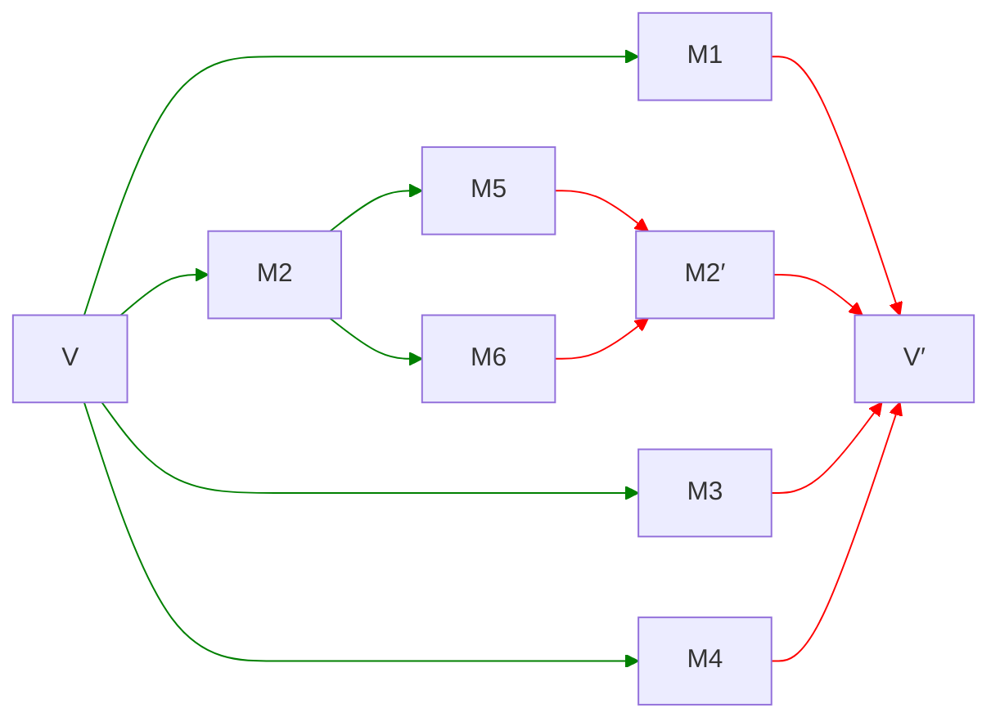

## C++26 Status Quo

I'd previously written about how difficult it is to extend support for using [class types as constant template parameters]().

> These are the template parameters formerly known as non-type template parameters. But it turns out that since C++98, we had _three_ kinds of template parameters: type template parameters, non-type template parameters, and template template parameters. While it's fine to name things X and non-X when you only have two categories (e.g. static and non-static member functions), it's decidedly less fine to do so when you have three. And now in C++26, we have five (also variable template parameters and concept template parameters), so don't all of the ones that are not type parameters count as "non-type"? For that reason, the term has been changed to the significantly better name "constant template parameter."
{:.prompt-info}

That blog post followed on from a paper I wrote with Richard Smith ([P2484](https://wg21.link/p2484)), and was followed by another paper on this subject ([P3380](https://wg21.link/p3380)). The blog post (and subsequent paper) was based a brilliant insight from Faisal Vali that reflection offers an interesting solution to solving the serialization problem: `std::meta::info` can represent anything.

In the Sofia meeting, all of the reflection-related papers were adopted in the working draft for C++26, and it is very exciting to me to be able to now see all of the wording show up on in the draft itself (e.g. [\[meta.reflection\]](http://eel.is/c++draft/meta.reflection)). However, my solution for extending support for constant template parameters will not be C++26. Nor is any solution to the [non-transient constexpr allocation problem](). So we're still stuck with the same strict limits on what types we can use as constant template parameters for another cycle.

Or... are we?

## Towards a Library Solution

The fundamental idea of the paper is that we take some value `V`, break it down into its constituent parts, define template-argument-equivalence in terms of those parts, and then reconstitute some new value `V'` out of those parts to ensure consistency and avoid any ODR issues. That serialization and deserialization can be arbitrary complicated, but that's what it boils down to:



It turns out that, while I haven't attempted to implement this in a compiler (and, even if I do so, it wouldn't help anybody since it's not in C++26), we actually have the tools to get a pretty good approximation in C++26. It won't be as ergonomic or convenient to use as a dedicated language feature would be, but I think it's still a useful exercise and should prove quite useful in practice as well. Indeed, if the library solution were as ergonomic and convenient as a language solution, why would we even bother with a language solution?

So let's see what we can do in the library. If you're interested in working through how I got to a functional design and how it works, read on. If not, you can skip ahead to [the end product](#introducing-ctp).

### Interface

The first thing we need to talk about is the interface. The shape of the solution should look something like this:

```cpp
namespace ctp {
  template <class T>
  struct Param {
    // TBD: some representation here
    consteval Param(T const& value);
    consteval auto get() const -> T const&;
  };
}
```

That allows for fairly nice looking usage:

```cpp
template <ctp::Param<Type> V>
struct X {
    // use V.get()
};

template <ctp::Param V>
struct Y {
    // use V.get()
};
```

The former is for when you want `template <Type V>` but `Type` is not a C++20 structural type. The latter is for when you want `template <auto V>` but want to a broader range of types. I think as far as ergonomics go, that's not so bad at all?

> For a refresher on C++20 structural, you can read the previously linked blog post as well as a recent one on [implementing]() the type trait `is_structural`, with reflection.
{:.prompt-info}

### Representation, Part I

The real question is what actually goes in the _body_ of `ctp::Param<T>`. How do we implement `Param<T>` such that `Param<T>` is

* always C++20 structural and
* provides the correct template-argument-equivalence guarantees.

That is, `ctp::Param<V1>` and `ctp::Param<V2>` should be the same type whenever `V1` and `V2` are  suitably "equivalent."

Since an arbitrary value might require a variable-length amount of information to serialize, the first guess might be something like this:

```cpp
template <class T>
struct Param {
    std::vector<std::meta::info> contents;
};
```

But this doesn't work... doubly. First, because `std::vector<T>` isn't a structural type, so we can't use it as a representation. And second, because we don't have non-transient constexpr allocation, so even if `std::vector<T>` were structural, we can't deal with the allocation.

Similarly, `std::span<std::meta::info const>` helps the second problem but not the first, since `std::span<T>` isn't structural either.

What else can we try?

Well, it turns out that we cannot use `vector` or `span` here. Nor can we use something like a `std::array<std::meta::info, N>` or `std::meta::info[N]` because, despite both types being structural types that don't require allocation, we don't have a way of knowing what `N` is — since our type might require a variable-length serialization.

But we can have a _single_ `std::meta::info` that itself represents an object whose type is `std::meta::info[N]`, where different values of `T` could have different reflections representing differently-sized arrays. And two objects of type `std::meta::info` are template-argument-equivalent if they're equal, and one of the ways in which they can be equal is if both represent the same object.

How do we do that?

Let's say we have a `std::vector<std::meta::info>` containing those serialized reflections that we want to represent. We can create a variable template that takes those `meta::info`s as constant template parameters and initializes an array from them:

```cpp
template <std::meta::info... Is>
inline constexpr std::meta::info storage[] = {Is...};
```

It is already the case, from the usual template rules, that `storage<I...>` and `storage<J...>` are the same object if and only if `{I...}` and `{J...}` are the same reflections. So if we could take our `vector{I...}` and turn it into `storage<I...>`, we've solved our problem.

How do we do that? With `std::meta::substitute`. Specifically:

```cpp
consteval auto to_array(std::vector<std::meta::info> v)
    -> std::meta::info
{
    for (std::meta::info& r : v) {
        r = reflect_constant(r);
    }
    return substitute(^^storage, v);
}
```

Here, `to_array(vector{I...})` gives us a reflection representing the object `storage<I...>`. We need to turn every `meta::info` into a reflection representing a value of `meta::info` because `substitute` will remove one layer of reflection. The above is a mouthful, but we don't have to implement it ourselves every time — this is what `std::meta::reflect_constant_array` does.

> Note that `std::meta::reflect_constant_array` takes a range of `V` (for any structural `V`) and gives you back a reflection of an object of type `V[N]`. It's not specific to `meta::info`.
{:.prompt-info}


If we have some customization point `ctp::serialize(v)` that takes an arbitrary `T` and returns a `std::vector<std::meta::info>`, then our representation can be:

```cpp
template <class T>
struct Param {
    std::meta::info contents;

    consteval Param(T const& v)
        : contents(std::meta::reflect_constant_array(
            ctp::serialize(v)
        ))
    { }
};
```

Which then we could have a `ctp::deserialize<T>` customization point to get you back to the `T`:

```cpp
template <class T>
struct Param {
    // represents some arbitrary array of reflections
    std::meta::info contents;

    consteval Param(T const& v)
        : contents(std::meta::reflect_constant_array(
            ctp::serialize(v)
        ))
    { }

    consteval auto get() const -> T  {
        return ctp::deserialize<T>(contents);
    }
};
```

This works great. This meets our requirements — `meta::reflect_constant_array` ensures that if two values serialize to equal contents, then `contents` will represent the same array.

### Representation, Part II

However, returning a `T` by value there is a little awkward. Do we want `Param<T>::get()` to give you a prvalue or an lvalue? I think we'd want an lvalue. That's more consistent with how constant template parameters of class type behave — there's an object there. So maybe `deserialize<T>`'s job is to produce that object too.

However, what if we just did that slightly more directly? That is, we rotate our implementation of `Param` a bit:

```cpp
namespace ctp {
    template <class T>
    struct Param {
        // represents some object of type T
        std::meta::info contents;

        consteval Param(T const& v)
            : contents(ctp::deserialize<T>(ctp::serialize(v)))
        { }

        consteval auto get() const -> T const& {
            return extract<T const&>(contents);
        }
    };
}
```
{: data-line="8,11-12" .line-numbers }

This is, I think, an improvement. We're getting an lvalue and now our `get()` basically doesn't do anything except for a simple access.

Now, what's going on in our constructor here? We are taking a value `v` of type `T` and — by way of round-tripping through a bunch of reflections — producing a reflection representing an object of type `T` (that is equivalent to `v`). That operation already exists in the standard library — that's `std::meta::reflect_constant(v)`. Except it only works for C++20 structural types, so since here I am trying to support more types, that seems like exactly the right name for the customization point: `ctp::reflect_constant(v)`.

```cpp
namespace ctp {
    template <class T>
    struct Param {
        // represents some object of type T
        std::meta::info contents;

        consteval Param(T const& v)
            : contents(ctp::reflect_constant(v))
        { }

        consteval auto get() const -> T const& {
            return extract<T const&>(contents);
        }
    };
}
```
{: data-line="8" .line-numbers }

Great. Before I get into how to actually do that though...

### Representation, Part III

Why bother storing the `meta::info` at all? If we're producing a `meta::info` which represents some object of type `T`, why don't we just store the reference to that object directly? That still meets our template-argument-equivalence goal, since `T&` is always structural.

That is:

```cpp
namespace ctp {
    template <class T>
    struct Param {
        T const& object;

        consteval Param(T const& v)
            : object(extract<T const&>(ctp::reflect_constant(v)))
        { }

        consteval auto get() const -> T const& {
            return object;
        }
    };
}
```
{: data-line="7" .line-numbers }

This operation — taking a value `v` of type `T` and producing a static storage duration object that is equivalent to it — also exists in the standard library for C++26, under the name `std::define_static_object` (note that it is in `std::` and not in `std::meta::`). So we'll use that name here too:

```cpp
namespace ctp {
    template <class T>
    struct Param {
        T const& object;

        consteval Param(T const& v)
            : object(ctp::define_static_object(v))
        { }

        consteval auto get() const -> T const& {
            return object;
        }
    };
}
```
{: data-line="7" .line-numbers }

## Customizing `ctp::reflect_constant`

Now that we have a sense of what we want the representation of `ctp::Param<T>` to look like — just as simple as having a member `T const&` — let's go through a bunch of common standard library types to see how we can make this actually work.

We need to customize what `ctp::reflect_constant(v)` does for a value of type `T` — it needs to somehow return a reflection representing an object of type `T` that is equivalent to `v`. We're going to do that by way of specializing a class template:

```cpp
template <class T>
struct Reflect {
    consteval auto serialize(T const&) -> /* ??? */;
    consteval auto deserialize(/* ??? */) -> T;
};
```

I'll get into how this is invoked shortly, but for now this is the interface. The goal of `serialize` is to produce the sequence of reflections that define template-argument-equivalence and the goal of `deserialize` is to initialize the object that `ctp::reflect_constant` is going to return a reflection representing.

What should `serialize` have to return, and what should `deserialize` accept? Let's start simple: `std::vector<std::meta::info>` for both. I'll come up with something more ergonomic later.

Given that design idea, we can implement `ctp::reflect_constant` like this:

```cpp
template <class T, std::meta::info... Is>
inline constexpr T the_object = Reflect<T>::deserialize(
    std::vector<std::meta::info>{Is...}
);

template <class T>
consteval auto reflect_constant(T const& v) -> std::meta::info {
    std::vector<std::meta::info> args = {^^T};

    // need to add a layer of reflection
    for (auto r : Reflect<T>::serialize(v)) {
        args.push_back(std::meta::reflect_constant(r));
    }

    return substitute(^^the_object, args);
}
```

This way, we can actually use the same variable template to handle every type we're specializing. Which seems pretty nice.

### Supporting `std::string`, Part I

Serializing a `std::string` is pretty easy — we just need to serialize every character in it. We could just do that one at a time:

```cpp
template <>
struct Reflect<std::string> {
    static consteval auto serialize(std::string const& s)
        -> std::vector<std::meta::info>
    {
        std::vector<std::meta:::info> v;
        for (char c : s) {
            s.push_back(std::meta::reflect_constant(c));
        }
        return v;
    }

    static consteval auto deserialize(std::vector<std::meta::info> v)
        -> std::string
    {
        std::string s;
        for (std::meta::info r : v) {
            s.push_back(extract<char>(r));
        }
        return s;
    }
};
```

We could also go simpler and use the utility we have directly for this — `std::meta::reflect_constant_string` takes a string and returns a reflection of some `char const[N]` with those contents (null-terminated).

That would look like:

```cpp
template <>
struct Reflect<std::string> {
    static consteval auto serialize(std::string const& s)
        -> std::vector<std::meta::info>
    {
        return {std::meta::reflect_constant_string(s)};
    }

    static consteval auto deserialize(std::vector<std::meta::info> v)
        -> std::string
    {
        return std::string(
            extract<char const*>(v[0]),
            extent(type_of(v[0])) - 1
        );
    }
};
```
{: data-line="6,13-14" .line-numbers }

The `- 1` here is because for `"hello"s`, we get a reflection of an object of type `char const[6]`, and we want to construct the `std::string` from just the first `5`. Even though the array is null-terminated, we want to explicitly provide the size to handle embedded nulls.

In general with this design, we can serialize our type any way we want, as long as `serialize` and `deserialize` agree with each other. These two approaches — one serialized `N` reflections of values and the other one reflection of an object — are both totally fine.

There's only one problem. It doesn't really work.

Here's our object declaration again:

```cpp
template <class T, std::meta::info... Is>
inline constexpr T the_object = Reflect<T>::deserialize(
    std::vector<std::meta::info>{Is...}
);
```

Here, `the_object` is a `constexpr` variable. If we try to have a `ctp::Param<std::string>` that is sufficiently long to require allocation, we cannot initialize `the_object` like this. Because we still don't have non-transient constexpr allocation!

> Seriously, how many times will this come up in this post!
{:.prompt-info}

Now, you might think this is because we're trying to have `Param<T>::get()` be a `T const&`, so we need an object, and so we were required to try to declare this object `constexpr`. But what if we loosened that restriction a bit and allowed `Param<T>::get()` to return a `T` so that we don't need a `constexpr` object? That still wouldn't help — that would simply require that _all_ uses of `get()` must be constant expressions, which is too severe a limitation to be useful. Especially for a type like `std::string`.

That means that, as far as I'm aware right now, it's a fundamental limitation that we cannot deserialize back into a `std::string`.

### Supporting `std::string`, Part II

Alright, so while it's straightforward enough to serialize a `std::string`, we cannot deserialize back into specifically that type. But that's okay, we can come up with alternatives.

In this case, there happens to be a pretty clear one: `std::string_view`. After all, we're talking about a context in which both:

1. mutation is impossible, and
2. there are no lifetime issues

Given that we're serializing into a static storage duration array, we can simply deserialize a `std::string_view` to that array!

That is, we make this slight change here:

```cpp
template <>
struct Reflect<std::string> {
    using target_type = std::string_view;

    static consteval auto serialize(std::string const& s)
        -> std::vector<std::meta::info>
    {
        return {std::meta::reflect_constant_string(s)};
    }

    static consteval auto deserialize(std::vector<std::meta::info> v)
        -> std::string_view
    {
        return std::string_view(
            extract<char const*>(v[0]),
            extent(type_of(v[0])) - 1
            );
    }
};
```
{: data-line="3,12,14-17" .line-numbers }

Now we have to propagate this change up to a lot of places. Let's also take the opportunity to be slightly more ergonomic — we'll also change the way `deserialize` is invoked to pass all of the reflections rather than first wrapping them in a `vector`:

```cpp
namespace ctp {
    template <class T>
    using target = Reflect<T>::target_type;

    template <class T>
    struct Param {
        target<T> const& object;

        consteval Param(T const& v)
            : object(ctp::define_static_object(v))
        { }

        consteval auto get() const -> target<T> const& {
            return object;
        }
    };

    template <class T, std::meta::info... Is>
    inline constexpr target<T> the_object =
        Reflect<T>::deserialize(Is...);

    template <>
    struct Reflect<std::string> {
        using target_type = std::string_view;

        static consteval auto serialize(std::string const& s)
            -> std::vector<std::meta::info>
        {
            return {std::meta::reflect_constant_string(s)};
        }

        static consteval auto deserialize(std::meta::info r)
            -> std::string_view
        {
            return std::string_view(
                extract<char const*>(r),
                extent(type_of(r)) - 1
                );
        }
    };
}
```
{: data-line="2-3,7,13,19-20,32" .line-numbers }

Because `reflect_constant_string` gives us a reflection representing an object that has static storage duration, returning a `string_view` to that is safe from a lifetime perspective. And now that we just get the single reflection into `deserialize`, this seems pretty nice.

### Supporting C++20 Structural Types

Now, let's back up a bit. So far, `ctp::Param<T>` always holds a `target<T> const&` and `ctp::reflect_constant` always goes through `ctp::Reflect<T>`. But that's not strictly necessary.

If `T` is already a C++20 structural type, we don't need to do any of this. `ctp::Param<T>` can just hold a `T` in this case! So let's go ahead and do that:

```cpp
namespace ctp {
    template <class T> requires (is_structural_type(^^T))
    struct Param<T> {
        T value;

        consteval Param(T const& v)
            : value(std::meta::reflect_constant(v))
        { }
        consteval auto get() -> T const& { return value; }
    };

    inline constexpr auto reflect_constant =
        []<class T>(T const& v){
            if constexpr (is_structural_type(^^T)) {
                return std::meta::reflect_constant(v);
            } else {
                std::vector<std::meta::info> args = {^^T};
                for (auto r : Reflect<T>::serialize(v)) {
                    args.push_back(std::meta::reflect_constant(r));
                }
                return substitute(^^the_object, args);
            }
        };

    inline constexpr auto define_static_object =
        []<class T>(T const& v) -> auto const& {
            if constexpr (is_structural_type(^^T)) {
                return *std::define_static_object(v);
            } else {
                auto r = reflect_constant(v);
                return extract<target<T> const&>(r);
            }
        };
}
```
{: data-line="2-10,14-16,27-29" .line-numbers }


### Adding some convenience

In addition to just passing all the reflections directly, instead of as a `std::vector<std::meta::info>`, there is one more thing we can do for convenience: provide a type to help out with serialization. This is similar to what I'd proposed in [P3380](https://wg21.link/p3380):

```cpp
namespace ctp {
    class Serializer {
        std::vector<std::meta::info> parts;

    public:
        consteval explicit Serializer(std::meta::info type) {
            parts.push_back(type);
        }

        consteval auto push(std::meta::info r) -> void {
            // need to add a layer of reflection
            parts.push_back(std::meta::reflect_constant(r));
        }

        consteval auto finalize() const -> std::meta::info {
            return substitute(^^the_object, parts);
        }
    };
}
```

This makes our customization point easier to deal with:

```cpp
namespace ctp {
    inline constexpr auto reflect_constant =
        []<class T>(T const& v){
            if constexpr (is_structural_type(^^T)) {
                return std::meta::reflect_constant(v);
            } else {
                auto s = Serializer(^^T);
                Reflect<T>::serialize(s, r);
                return s.finalize();
            }
        };
}
```
{: data-line="7-9" .line-numbers }

As well as the actual `std::string` customization:

```cpp
namespace ctp {
    template <>
    struct Reflect<std::string> {
        using target_type = std::string_view;

        static consteval auto serialize(Serializer& ser,
                                        std::string const& str)
            -> void
        {
            ser.push(std::meta::reflect_constant_string(str));
        }

        static consteval auto deserialize(std::meta::info r)
            -> std::string_view
        {
            return std::string_view(
                extract<char const*>(r),
                extent(type_of(r)) - 1
                );
        }
    };
}
```
{: data-line="6-11" .line-numbers }

### Summarizing the Design

Let's back up and go over what the design actually is.

`ctp::Param<T>` has, for non-C++20 structural `T`, a single member that is a public `ctp::target<T> const&`, referring to a static storage duration object. Two `Param<T>`s constructed from "equal" values need to have their respective references refer to the _same_ object.

We achieve the same object requirement by way of a serialization and deserialization step. The serialization step `push`es an arbitrary amount of `std::meta::info`s into a `ctp::Serializer`. The deserialization step takes those `std::meta::info`s as function arguments and needs to return an object of type `type`.

If two objects of type `T` serialize to the same sequence of `std::meta::info`s, then `ctp::define_static_object` will return a reference to the _same_ specialization of `ctp::the_object`, which means it's the same object.

But so far, all we've done is `std::string`. Let's tackle some other types too.

### Supporting `std::vector`

`std::vector<T>` isn't all too different from `std::string`, but in order to handle it properly we need to make a bunch of changes.

First, we need to figure out what to use for our target type. It can't be `std::vector<T>` for two reasons:

1. it cannot be `T`, because `T` might have a different target type, and
2. it cannot be `std::vector`, because `std::vector` needs to allocate.

The first issue pushes us to `std::vector<target<T>>` and the second to `std::span<target<T> const>`. For the same reason that `std::string_view` is good enough for `std::string`, `std::span<T const>` is good enough for `std::vector<T>` — we can't have mutation anyway, so what's the difference?

That is, we're going to do this:

|type|target type|
|-|-|
|`std::vector<int>`|`std::span<int const>`|
|`std::vector<std::string>`|`std::span<std::string_view const>`|

Next, in order to be able to have a `std::span<T const>`, we have to create some array `T[N]` to return a `span` to. For that, the standard library has `std::meta::reflect_constant_array`. That one is defined in terms of `std::meta::reflect_constant`, so what we need is our own `ctp::reflect_constant_array` defined in terms of our own `ctp::reflect_constant`. Yes, I had actually replaced it with `ctp::define_static_object` in the previous section, but it turns out we need it back.

In order to provide a `reflect_constant_array`, we need a variable template to `substitute` into, which I'll unimaginatively name `the_array`:

```cpp
template <class T, std::meta::info... Is>
inline constexpr target<T> the_array[] = {[:Is:]...};
```

and then

```cpp
inline constexpr auto reflect_constant_array =
    []<std::ranges::input_range R>(R&& r){
        std::vector<std::meta::info> elems;
        elems.push_back(^^std::ranges::range_value_t<R>);
        for (auto&& e : r) {
            elems.push_back(reflect_constant(reflect_constant(e)));
        }
        return substitute(^^impl::the_array, elems);
    };
```

Here `reflect_constant` is `ctp::reflect_constant` (both times), not `std::meta::reflect_constant`.

Once we have this, then the actual customization for `std::vector<T>` looks nearly the same as for `std::string`:

```cpp
template <class T>
struct Reflect<std::vector<T>> {
    using target_type = std::span<target<T> const>;

    static consteval auto serialize(Serializer& s,
                                    std::vector<T> const& v)
        -> void
    {
        s.push(reflect_constant_array(v));
    }

    static consteval auto deserialize(std::meta::info r)
        -> std::span<target<T> const>
    {
        return std::span(
            extract<target<T> const*>(r),
            extent(type_of(r))
        );
    }
};
```

### Supporting `std::optional`

One way to think about `std::optional<T>` (for non-reference `T`, which is all I'm doing here so far) is that it is a range of at most 1 `T`. That is the most straightforward way to serialize it: you either serialize 0 or 1 objects.

Then, because of the way deserialization is set up in this library, we can overload on arity:

```cpp
template <class T>
struct Reflect<std::optional<T>> {
    using target_type = std::optional<target<T>>;

    static consteval auto serialize(Serializer& s,
                                    std::optional<T> const& o)
        -> void
    {
        if (o) {
            s.push(reflect_constant(*o));
        }
    }

    static consteval auto deserialize() -> target_type {
        return {};
    }

    static consteval auto deserialize(std::meta::info r) -> target_type {
        return extract<target<T> const&>(r);
    }
};
```

There are other ways to approach this from a library perspective that might be more or less convenient. Deserialization could, instead of taking all the `std::meta::info`s instead go back to taking a `std::vector<std::meta::info>` like I had earlier. That way deserialization would be:

```cpp
static consteval auto deserialize(std::vector<std::meta::info> v) -> target_type {
    return v.empty()
        ? target_type()
        : target_type(extract<target<T> const&>(v[0]));
}
```

Is that better? Not sure.

One thing that's at least a little bit better is to add more functionality to `Serializer` besides just `push`. For instance, we could add a function that does `push(reflect_constant(v))`. Let's call it `push_constant`. That at least simplifies:

```cpp
static consteval auto serialize(Serializer& s,
                                std::optional<T> const& o)
    -> void
{
    if (o) {
        s.push_constant(*o);
    }
}
```
{: data-line="6" .line-numbers }

However, what if we actually _did_ want to support `std::optional<T&>`? Here, the rules are different:

* If we have `optional<T>`, we want to serialize the constant `T` because we may need to round-trip. We end up with an `std::optional<target<T>>`.
* If we have `optional<T&>`, then we want to serialize the _object_ `T&`, and we _do not_ change type — we stick with `std::optional<T&>`.

That is:

|type|target type|
|`std::optional<std::string>`|`std::optional<std::string_view>`|
|`std::optional<std::string&>`|`std::optional<std::string&>`|

So we need a new trait:

```cpp
template <class T>
using target_or_ref = [:
    is_lvalue_reference_type(^^T)
    ? ^^T
    : substitute(^^target, {^^T})
:];
```

And we modify our implementation like so:

```cpp
template <class T>
struct Reflect<std::optional<T>> {
    using target_type = std::optional<target_or_ref<T>>;

    static consteval auto serialize(Serializer& s,
                                    std::optional<T> const& o)
        -> void
    {
        if (o) {
            if constexpr (is_lvalue_reference_type(^^T)) {
                s.push_constant(*o);
            } else {
                s.push_object(*o);
            }
        }
    }

    static consteval auto deserialize() -> target_type {
        return {};
    }

    static consteval auto deserialize(std::meta::info r) -> target_type {
        return extract<target_or_ref<T> const&>(r);
    }
};
```
{: data-line="3,10-14,23" .line-numbers }

Similar to how we added `Serializer::push_constant`, we can add `Serializer::push_object` for convenience. Moreover, this pattern probably isn't going to be too rare, so let's go ahead and add a `Serializer::push_constant_or_object` that takes a reflection of the type:

```cpp
template <class T>
struct Reflect<std::optional<T>> {
    using target_type = std::optional<target_or_ref<T>>;

    static consteval auto serialize(Serializer& s,
                                    std::optional<T> const& o)
        -> void
    {
        if (o) {
            s.push_constant_or_object(^^T, *o);
        }
    }

    static consteval auto deserialize() -> target_type {
        return {};
    }

    static consteval auto deserialize(std::meta::info r) -> target_type {
        return extract<target_or_ref<T> const&>(r);
    }
};
```
{: data-line="10" .line-numbers }

Okay that seems pretty nice to me.

### Supporting `std::tuple`

Now that we've tackled `std::optional`, `std::tuple` is actually pretty straightforward. We have to do the same constant-or-object dance, just for every element. But we always have every element, so no conditional necessary:

```cpp
template <class... Ts>
struct Reflect<std::tuple<Ts...>> {
    using target_type = std::tuple<target_or_ref<Ts>...>;

    static consteval auto serialize(Serializer& s,
                                    std::tuple<Ts...> const& t)
        -> void
    {
        auto& [...elems] = t;
        (s.push_constant_or_object(^^decltype(elems), elems), ...);
    }

    static consteval auto deserialize(auto... rs) -> target_type {
        return target_type(extract<target_or_ref<Ts> const&>(rs)...);
    }
};
```
Here, I'm also using the new C++26 feature that allows introducing a pack in structured bindings, and relying on a quirk of what `decltype` actually means on a structured binding to differentiate reference types from non-reference types. This does the right thing.

### Supporting `std::variant`

How do we serialize `std::variant<Ts...>`? We need to be able to know _which_ element the `variant `holds. It's not enough here to differentiate on type, since the `variant` could have multiple alternatives of the same type. So we'll serialize the index first and then the value by simply `visit`ing the variant.

> Actually, the `visit()` approach to serialization, surprisingly, doesn't work. I'm going to show the code as if it does, because it _should_ work, but it doesn't. The problem has to do with how variant visitation can be implemented, and how it is implemented in libc++. See [LWG 4197](https://cplusplus.github.io/LWG/issue4197) and my proposed fix for this by introducing `consteval` variables in [P3603](https://wg21.link/p3603).
{:.prompt-info}

But how do we deserialize?

```cpp
template <class... Ts>
struct Reflect<std::variant<Ts...>> {
    using target_type = std::variant<target<Ts>...>;

    static consteval auto serialize(Serializer& s,
                                    std::variant<Ts...> const& v)
        -> void
    {
        // 1. the index (a size_t)
        s.push_constant(v.index());
        // 2. the element (one of the Ts...)
        v.visit([&](auto const& o){
            s.push_constant(o);
        });
    }

    static consteval auto deserialize(std::meta::info idx,
                                      std::meta::info r)
        -> target_type
    {
        /// ???
    }
};
```

There are several approaches here. We could use the usual `mp_with_index` trick (from Boost.Mp11) to lift the `size_t` we get out of `idx` into a constant, and do in-place construction that way:

```cpp
static consteval auto deserialize(std::meta::info idx,
                                  std::meta::info r)
    -> target_type
{
    return mp_with_index<sizeof...(Ts)>(extract<size_t>(idx), [&](auto I){
        using T = Ts...[I];
        return target_type(std::in_place_index<I>,
                           extract<target<T> const&>(r));
    });
}
```

We could do the same without `mp_with_index` with an expansion statement:

```cpp
static consteval auto deserialize(std::meta::info idx,
                                  std::meta::info r)
    -> target_type
{
    template for (constexpr size_t I : std::views::indices(sizeof...(Ts))) {
        using T = Ts...[I];
        if (I == extract<size_t>(idx)) {
            return target_type(std::in_place_index<I>,
                               extract<target<T> const&>(r));
        }
    }
}
```

We could add a new `static consteval` function to our `Reflect` specialization that takes the index as a constant template parameter and the the object as a regular function parameter, like so:

```cpp
template <class... Ts>
struct Reflect<std::variant<Ts...>> {
    template <size_t I>
    static consteval auto deserialize_impl(std::meta::info r)
        -> target_type
    {
        using T = Ts...[I];
        return target_type(std::in_place_index<I>,
                           extract<target<T> const&>(r));
    }
};
```

which initially doesn't seem especially useful, but then one of the key reflection tricks is that the answer to every problem is `std::meta::substitute`. Every specialization of `deserialize_impl` above has the same type: `auto(std::meta::info) -> target_type`. Which means we can `extract` it:

```cpp
static consteval auto deserialize(std::meta::info idx,
                                  std::meta::info r)
    -> target_type
{
    // 1. This is the reflection of the appropriate specialization
    //    of deserialize_impl
    auto fn_refl = substitute(^^deserialize_impl, {idx});

    // 2. This is now a pointer to function (the one represented by
    //    the above reflection
    auto fn = extract<auto(*)(std::meta::info) -> target_type>(fn_refl);

    // 3. Which now you can just invoke
    return fn(r);
}
```

That last one is, needless to say, a bit mind-bending. But it's an extremely useful technique when it comes to reflection.

Which should we do?

Well, we should step back and recognize that we're struggling because we're trying to shoehorn a solution into the box I came up with for how `deserialize` is invoked:

```cpp
template <class T, std::meta::info... Is>
inline constexpr target<T> the_object = Reflect<T>::deserialize(Is...);
```

If we had access to the `Is` as _constants_, then the solution would be much simpler. For instance, if we could `substitute` instead into _this_ variable template:

```cpp
template <size_t I, std::meta::info R>
static constexpr auto the_object = target_type(std::in_place_index<I>, [:R:]);
```

That is, after all, exactly what we want to do. So how about we just... let ourselves do that. Instead of having the extension point unconditionally evaluate `Reflect<T>::deserialize(Is...)`, we'll give the user three options:

1. `deserialize<Is...>()`
2. `deserialize(Is...)`
3. `deserialize_constants([:Is:]...)`

This allows the `variant` deserialization to get the constants it needs:

```cpp
template <class... Ts>
struct Reflect<std::variant<Ts...>> {
    using target_type = std::variant<target<Ts>...>;

    template <std::meta::info I, std::meta::info R>
    static consteval auto deserialize() -> target_type {
        return target_type(std::in_place_index<([:I:])>, [:R:]);
    }
};
```

While this third form I'm adding also simplifies some of the other customizations we've already seen. For instance, `tuple` looked like this:

```cpp
static consteval auto deserialize(auto... rs) -> target_type {
    return target_type(extract<target_or_ref<Ts> const&>(rs)...);
}
```

and becomes:

```cpp
static consteval auto deserialize_constants(target_or_ref<Ts> const&... vs)
    -> target_type
{
    return target_type(vs...);
}
```

Which maybe doesn't seem like a huge improvement until I point out that this latter one is completely correct but the former was actually wrong. If one of the `meta::info`s represented a _value_ (e.g. we're doing `tuple<int>`, that `int` passed through `reflect_constant` becomes a reflection of a value as opposed to an object), then we cannot do `extract<int const&>(r)` — because there's no object. That's possible to work around, by introducing a new kind of `extract_maybe_ref<T>` that for scalar types does `extract<T>` and for class types does `extract<T const&>`... but this way we just don't have to.

It's maybe more obviously better if we do a type like `std::reference_wrapper<T>`, where we can just deserialize a `T&`:

```cpp
template <class T>
struct Reflect<std::reference_wrapper<T>> {
    using target_type = std::reference_wrapper<T>;

    static consteval auto serialize(Serializer& s,
                                    std::reference_wrapper<T> r)
        -> void
    {
        s.push_object(r.get());
    }

    static consteval auto deserialize_constants(T& r) -> target_type {
        return r;
    }
};
```

And we'll see another case where it's obviously better in a bit.

### Supporting string literals

The last one I'll do for this blog post is string literals. Having a value usable as a constant template argument has two components:

* its type has to be _structural_ (which I'm extending here), and
* the value has to meet certain requirements ([\[temp.arg.nontype\]/6](https://eel.is/c++draft/temp#arg.nontype-6)).

One of those requirements, by far the most common one people will run into, is that no part of the value (recursively all the way down) points or refers to a string literal (or a subobject thereof).

Why aren't string literals usable? Let's take the simplest possible case:

```cpp
template <char const*> X { };

X<"hello"> a;
X<"hello"> b;
```

There is a _very strong_ expectation that `a` and `b` have the same type, but the language does _not_ guarantee that multiple evaluations of the same string literal produce the same pointer — certainly not across multiple translation units. If you happened to get different pointers, you'd get different types — because template-argument-equivalence for two `char const*`s is checking if they're the same pointer value. You would need to guarantee that the same string literal reliably produces the same pointer value.

Thankfully, we can fix this in the library too.

Right now, for structural types, we have this specialization of `Param`:

```cpp
template <class T> requires (is_structural_type(^^T))
struct Param<T> {
    T value;

    consteval Param(T const& v) : value(v) { }
    consteval auto get() const -> T const& { return value; }
};
```

The problem is, `Param<char const*>("hello")` will initialize the pointer just fine, but `value` will point to a string literal, and that's not allowed. We need to change it to something else. Which we have the power to do — we've already seen a use of `std::meta::reflect_constant_string` and we also have `std::define_static_string`. But we cannot _unconditionally_ invoke that:

```cpp
template <ctp::Param V>
struct C {
    static constexpr auto const& object = V.value;
};

constexpr char const msg[] = "hello";
C<"hello"> a;
C<msg> b;
```

We want `a` to work, by promoting the string literal `"hello"` to static storage. But `msg` is _already_ a valid constant template parameter. We expect that `b.object == msg` and that `a` and `b` have different types. How do we differentiate these cases?

One of the other new C++26 functions is `std::is_string_literal` — which precisely answers this question. That allows us to conditionally promote only the string literals. That is:

```cpp
consteval auto normalize_pointer(char const* p) -> char const* {
    if (std::is_string_literal(p)) {
        return std::define_static_string(std::string_view(p));
    } else {
        return p;
    }
}
```

That's enough to make string literals work (I'll show where this slots in shortly). But it seems incomplete to me. Consider:

```cpp
constexpr char const* p = "stop";
C<p> stop;
C<p+1> top;
```
What _should_ we be able to say about `stop.object` vs `top.object`? With the `normalize_pointer` implementation, we cannot say anything except that they're definitely different pointers. But maybe we should be able to expect that `stop.object + 1 == top.object`?

I implemented, but have not yet even proposed, a more general function called `std::string_literal_from(p)`. What this does is return `nullptr` if `p` isn't a string literal, but if it is, it returns a pointer to the first character. That allows me to normalize like this:

```cpp
consteval auto normalize_pointer(char const* p) -> char const* {
    if (auto root = std::string_literal_from(p)) {
        char const* global = std::define_static_string(
            std::string_view(root));
        return p = global + (p - root);
    } else {
        return p;
    }
}
```

That is, instead of promoting `p` we promote from the `root` and apply the same offset to `global`. That gives us `stop.object + 1 == top.object`, by construction, since both promote `"stop"` and offset into it (by `0` and `1`, respectively).

We can fit this into the library by adding a new function object:

```cpp
inline constexpr auto normalize =
    []<class T>( T& v) -> void {
        if constexpr (requires { std::is_string_literal(v); }) {
            if (char const* root = std::string_literal_from(v)) {
                char const* global = std::define_static_string(
                    std::string_view(root));
                v = global + (v - root);
            }
        }
    };
```

And invoking it:

```cpp
template <class T> requires (is_structural_type(^^T))
struct Param<T> {
    T value;

    consteval Param(T const& v) : value(v) { ctp::normalize(value); }
    consteval auto get() const -> T const& { return value; }
};
```
{: data-line="5" .line-numbers }

That's enough already to support string literals:

```cpp
template <ctp::Param V> struct X { };

X<"hello"> a;  // ok
X<"hello"> b;  // ok, same type as a
X<"other"> c;  // ok, different type from a and b
```

But we can do one better. If we _also_ `normalize` in `reflect_constant`:

```cpp
inline constexpr auto reflect_constant =
    []<class T>(T v){
        if constexpr (is_structural_type(^^T)) {
            normalize(v);
            return std::meta::reflect_constant(v);
        } else {
            auto s = Serializer(^^T);
            Reflect<T>::serialize(s, r);
            return s.finalize();
        }
    };
```
{: data-line="4" .line-numbers }

Then we're already, basically for free, supporting `tuple<char const*>`, `optional<char const*>`, and `vector<char const*>` — if any of those `char const*`s anywhere are string literals.

It _also_ lets us very easily support `std::string_view`:

```cpp
template <>
struct Reflect<std::string_view> {
    using target_type = std::string_view;

    static consteval auto serialize(Serializer& s, std::string_view sv) -> void {
        s.push_constant(sv.data());
        s.push_constant(sv.size());
    }

    static consteval auto deserialize_constants(char const* data, size_t size)
        -> std::string_view
    {
        return std::string_view(data, size);
    }
};
```

And I think that's a pretty good stopping point for description. So far we've walked through supporting `string`, `vector<T>`, `optional<T>`, `tuple<Ts...>`, `variant<Ts...>`, `reference_wrapper<T>`, string literals (including inside of any of the previous ones), and `string_view`. That's pretty spectacular.

## Introducing `ctp`

Now that we've gotten this far, it's time to formally introduce the library. I implemented the above in a library I'm uncreatively calling `ctp`, for `c`onstant `t`emplate `p`arameters. You can find it [here](https://github.com/brevzin/ctp).

One way to think about the library is that it is a generalization of existing language and library features by way of extension:

|C++26|With `ctp`|
|-|-|
|`std::meta::reflect_constant(v)`|`ctp::reflect_constant(v)`|
|`std::meta::reflect_constant_array(r)`|`ctp::reflect_constant_array(v)`|
|`std::define_static_object(v)`|`ctp::define_static_object(v)`|
|`template <auto V>`|`template <ctp::Param V>`|
|`template <T V>`|`template <ctp::Param<T> V>`|

It's really as simple as that. If you wanted a `std::string` template parameter, you cannot write this:

```cpp
template <std::string S> // ill-formed
struct C {
    // would use S here
};
```

But you can now write this:

```cpp
template <ctp::Param<std::string> S>
struct C {
    // use S.value or S.get() here
};
```

The library (as of this writing) supports: `std::string_view` and `std::string`, `std::optional<T>` and `std::variant<Ts...>`, `std::tuple<Ts...>`, `std::reference_wrapper<T>`, `std::span<T, N>`, and `std::vector<T>`.

If you want to add support for your own (non-C++20 structural) type, you can do so by specializing `ctp::Reflect<T>`, which has to have three public members:

1. A type named `target_type`. This is you are going to deserialize as, which can be just the very same `T`. But if `T` requires allocation, then it cannot be, and you'll have to come up with an approximation (e.g. for `std::string`, the `target_type` is `std::string_view`).
2. The function

   ```cpp
   static consteval auto serialize(Serializer&, T const&) -> void;
   ```

    which pushes an arbitrary amount of reflections onto the `Serializer`. These reflections define template-argument-equivalence for `T`: two values that serialize the same reflections will produce the same object.
3. A deserialization function, which is going to take as its input each reflection that was serialized by `serialize`, in one of three forms. Choose the one most appropriate for your type:

   ```cpp
   // 1. Take each serialization as a constant template parameter
   template <meta::info R1, meta::info R2, ...>
   static consteval auto deserialize() -> target_type;

   // 2. Take each serialization as a function parameter
   static consteval auto deserialize(info R1, info R2, ...)
       -> target_type;

   // 3. Take the splice of serialization as a function parameter
   static consteval auto deserialize_constants(T1 t1, T2 t2, ...)
       -> target_type;
   ```

    In the library, `variant` uses the first form, `vector` and `string` use the second, and `optional`, `tuple`, `reference_wrapper`, and `string_view` use the third.

This library achieves two things.

First, it is just, in general, very useful. I'm hoping to make it more of a Real Library™️ once Reflection gets implemented in more than just the Bloomberg fork of Clang that Dan Katz implemented.

Second, I think it demonstrates the power of Reflection. There are so many problems that were not possible in C++23 that become solvable in C++26. We're going to spend the next several years discovering more of those, and that makes it a pretty exciting time for C++.